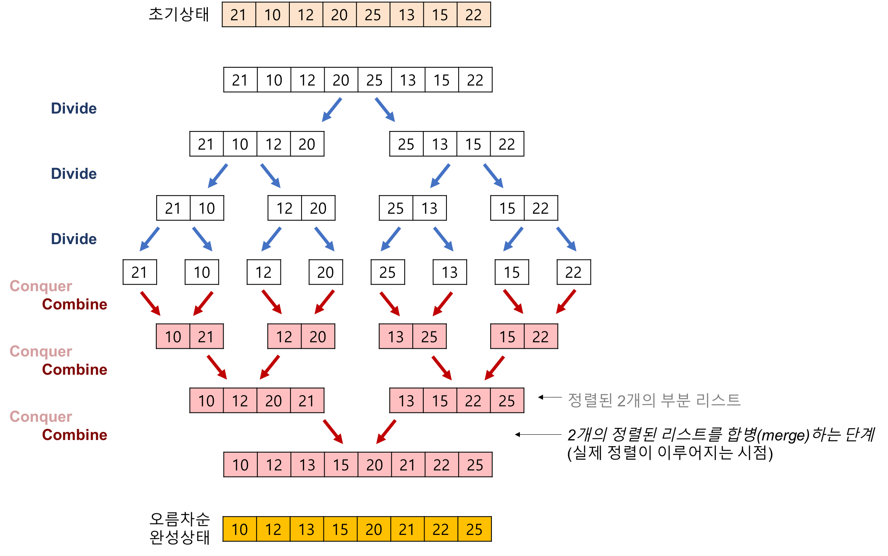
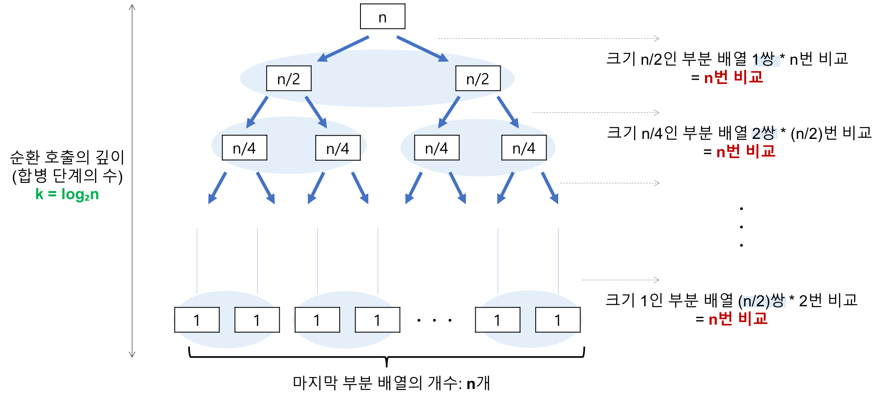

# 병합 정렬(Merge Sort)

### 개요

- 존 폰 노이만이 제안
- 분할 정복 패러다임에 기반하는 알고리즘
    - 큰 문제를 아주 작은 문제로 나눈 뒤 작은 문제를 해결하며 최종적으로 큰 문제를 해결한다.
    - 대개 순환 호출을 이용하여 구
- 삽입, 버블, 선택 과 같은 추가적인 자료구조 없이 정렬하는 Inplace 정렬과 달리 정렬한 데이터를 추가적인 임시 공간에 저장한다.

### 프로세스

1. 리스트의 길이가 0 또는 1이면 이미 정렬된 것으로 본다.
2. 그렇지 않은 경우 정렬되지 않은 리스트를 절반으로 잘라 비슷한 크기의 두 부분 리스트로 나눈다.
3. 각 부분 리스트를 재귀적으로 합병 정렬을 이용해 정렬한다.

### 개념

- 하나의 리스트를 두 개의 균등한 크기로 분할하고 분할된 부분 리스트를 정렬한 다음, 두 개의 정렬된 부분 리스트를 합하여 전체가 정렬된 리스트가 되게 하는 방법
- 단계
    1. 분할 : 입력 배열을 같은 크기의 2개의 부분 배열로 분할
    2. 정복 : 부분 배열을 정렬한다. 부분 배열의 크기가 충분히 작지 않으면 순환 호출을 이용해 다시 분할 정복 방법을 적용
    3. 결합 : 정렬된 부분 배열들을 하나의 배열에 합병한다.
- 합병 정렬 과정
    - 추가적인 리스트가 필요
    - 각 부분 배열을 정렬할 때도 합병 정렬을 순환적으로 호출하여 적용
    - 합병 정렬에서 실제로 정렬이 이루어지는 시점은 2개의 리스트를 합병 하는 단계이다.

  


### Java Code

```java
public class MergeSort {

    public static void main(String[] args) {
        int[] nums = {3, 44, 38, 5, 47, 15, 36, 26};
        mergeSort(nums, 0, nums.length - 1);

        for (int num : nums) {
            System.out.print(num + " ");
        }
    }

    // 메인 함수로 병합 정렬을 수행하는 메서드
    public static void mergeSort(int[] arr, int left, int right) {
        if (left < right) {
            int mid = left + (right - left) / 2;

            // 왼쪽 부분 배열 정렬
            mergeSort(arr, left, mid);
            // 오른쪽 부분 배열 정렬
            mergeSort(arr, mid + 1, right);

            // 병합 수행
            merge(arr, left, mid, right);
        }
    }

    // 두 부분 배열을 병합하는 메서드
    public static void merge(int[] arr, int left, int mid, int right) {
        // 임시 배열을 만들고 크기를 계산합니다.
        int n1 = mid - left + 1;
        int n2 = right - mid;

        // 임시 배열을 생성합니다.
        int[] L = new int[n1];
        int[] R = new int[n2];

        // 데이터를 임시 배열에 복사합니다.
        for (int i = 0; i < n1; i++) {
            L[i] = arr[left + i];
        }
        for (int j = 0; j < n2; j++) {
            R[j] = arr[mid + 1 + j];
        }

        /* 병합 알고리즘 */

        int i = 0, j = 0;

        // 초기 인덱스 k
        int k = left;

        while (i < n1 && j < n2) {
            if (L[i] <= R[j]) {
                arr[k] = L[i];
                i++;
            } else {
                arr[k] = R[j];
                j++;
            }
            k++;
        }

        /* 남은 요소들을 복사 */

        // 왼쪽 배열의 나머지 요소들을 복사
        while (i < n1) {
            arr[k] = L[i];
            i++;
            k++;
        }

        // 오른쪽 배열의 나머지 요소들을 복사
        while (j < n2) {
            arr[k] = R[j];
            j++;
            k++;
        }
    }
}
```

### 시간복잡도

- 분할 단계 : 비교 연산과 이동 연산이 수행되지 않는다.
- 합병 단계 :
    - 비교횟수

  

    - 순환 호출의 깊이(합병 단계의 수)
        - 레코드의 개수 n이 2의 거듭제곱이라고 가정(n=2^k)했을 때, n=2^3의 경우, 2^3 → 2^2 → 2^1 → 2^0 순으로 줄어들어 순환 호출 깊이가 3임을 알 수 있다. 이것을 일반화 하면 n=2^k의 경우, k(k=log₂n)임을 알 수 있다.
        - k(k=log₂n)
    - 각 합병 단계의 비교 연산
        - 크기 1인 부분 배열 2개를 합병하는 데는 최대 2번의 비교 연산이 필요하고, 부분 배열의 쌍이 4개이므로 24 = 8번의 비교 연산이 필요하다. 다음 단계에서는 크기 2인 부분 배열 2개를 합병하는데 최대 4번의 비교 연산이 필요하고 … 마지막 단계에서는 크기 4인 부분 배열 2개를 합병하는 데 최대 8번의 비교 연산이 필요하고, 부분 배열의 쌍이 1개이므로 8 * 1 = 8 번의 비교 연산이 필요하다. 이것을 일반화하면 하나의 하병 단계에서는 최대n번의 비교 연산이 필요하다.
        - 최대 n번
    - 이동 횟수
        - 순환 호출의 깊이(합병 단계의 수)
            - k(k=log₂n)
        - 각 합병 단계의 이동연산
            - 임시 배열에 복사했다가 다시 가져와야 하므로 이동 연산은 총 부분 배열에 들어 있는 요소의 개수가 n인 경우, 레코드 이동이 2n번 발생한다.
            - 순환 호출의 깊이 만큼의 합병 단계 * 각 합엽 단계의 이동 연산
                - 2nlog₂n
- T(n) = nlog₂n(비교) + 2nlog₂n(이동) = 3nlog₂n = O(nlog₂n)

### 장점

- 안정적인 정렬 방법
    - 데이터의 분포에 영향을 덜 받는다. 즉, 입력 데이터가 무었이던 간에 정렬되는 시간은 동일하다. O(nlog₂n)
- 만약 레코드를 연결 리스트(Linked List)로 구성하면, 링크 인덱스만 변경되므로 데이터의 이동을 무시할 수 있을 정도로 작아진다.
    - 제자리 정렬로 구현 가능
- 크기가 큰 레코드를 정렬할 경우에 연결 리스트를 사용하면 합병 정렬은 퀵 정렬을 포함한 다른 어떤 정렬 방법보다 효율적이다.

### 단점

- 만약 레코드를 배열(Array)로 구성하면, 임시 배열이 필요하다.
    - 제자리 정렬이 아님
- 레코드들의 크기가 큰 경우에는 이동 횟수가 많으므로 매우 큰 시간적 낭비를 초래한다.