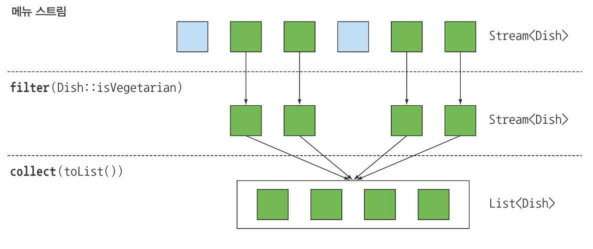

# 필터링

## 1. 프레디케이트로 필터링

스트림 인터페이스는 filter 메서드를 지원한다. filter메서드는 **프리디케이트(불리언 반환)**를 인수로 받아 프리디케이트와 일치하는 모든 요소를 포함시키는 스트림을 반환한다.

```java
// 베지테리언인 메뉴만 필터링
List<Dish> vegetarianMenu = menu.stream()
	.filter(Dish::isVegetarian) // 프리케이트 일치 확인
	.collect(toList());
```

- 프리디케이트로 스트림 필터링



## 2. 고유 요소로 필터링

스트림은 고유 요소로 이루어진 스트림을 반환하는 distinct 메서드를 지원한다(고유 여부는 스트림에서 만든 객체의 hashCoed, equals로 결정된다.).

```java
// 짝수를 선택하고 중복 필터링
List<Integer> numbers = Arrays.asList(1, 2, 1, 3, 3, 2, 4);
numbers.stream()
	.filter(i -> i % 2 == 0)
	.distinct()
	.forEach(System.out::println);
```

- 스트림에서 고유 요소만 피터링


# 스트림 슬라이싱

## 1. 프레디케이트를 이용한 슬라이싱

자바 9는 스트림의 요소를 효과적으로 선택할 수 있도록 takeWhile, dropwhile 두 가지 새로운 메서드를 지원한다.

### TAKEWHILE 활용

```java
//요리 목록
public List<Dish> specialMenu= Arrays.asList(
          new Dish("pork", false, 120, DishType.MEAT),
          new Dish("beef", false, 300, DishType.MEAT),
          new Dish("chicken", false, 350, DishType.MEAT),
          new Dish("french fries", true, 400, DishType.OTHER),
          new Dish("rice", true, 600, DishType.OTHER),
  );

//320칼로리 이하의 요리를 선택
List<Dish> filteredMenu = specialMenu.stream()
	.filter(dish -> dish.getCalories() <= 320)
	.collect(toList());
```

- 위 리스트는 이미 칼로리 순으로 정렬 되어 있으며, filter 연산을 이용하면 전체 스트림을 반복하면서 각 요소에 프레디케이트를 적용하게 된다.
- 따라서 리스트가 이미 정렬되어 있다는 사실을 이용해 320칼로리보다 크거나 같은 요리가 나왔을 때 반복 작업을 중단 할 수 있다.
- 작은 리스트에서는 이와 같은 동작이 별거 아닌 것처럼 보일 수 있지만 아주 많은 요소를 포함하는 큰 스트림에서는 상당한 차이가 될 수 있다.
- takeWhile 연산을 이용하면 이를 간단하게 처리할 수 있다 takewhile을 이용하면 무한스트림을 포함한 모든 스트림에 프레디케이트를 적용해 스트림을 슬라이스할 수 있다.

```java
List<Dish> takeWhileMenu = specialMenu.stream()
	.takeWhile(dish -> dish.getCalories() < 320)
	.collect(toList());
```

### DROPWHILE 활용

- 나머지 요소를 선택하고 싶을 때 사용

```java
// 320칼로리보다 큰 요소를 탐색
List<Dish> dropWhileMenu = specialMenu.stream()
	.dropWhile(dish -> dish.getCalories() < 320)
	.collect(toList());
```

- dropWhile은 takeWhile과 정반대의 작업을 수행한다. dropWhile은 프레디케이트가 처음으로 거짓이 되는 지점까지 발견된 요소를 버린다.
- 프레디케이트가 거짓이 되면 그 지점에서 작업을 중단하고 남은 요소를 반환한다.
- dropWhile은 무한한 남은 요소를 가진 무한 스트림에서도 동작한다.

## 2. 스트림 축소

- 스트림은 주어진 값 이하의 크기를 갖는 새로운 스트림을 반환하는 limit(n)메서드를 지원한다.
- 스트림이 정렬되어 있으면 최대 요소 n개를 반환할 수 있다.

```java
List<Dish> limitDishes = specialMenu.stream()
	.filter(dish -> dish.getCalories() < 320)
	.limit(3) // 프레디케이트와 일치하는 처음 세 요소를 선택
	.collect(toList());
```

- 스트림 연결


- 정렬되지 않은 스트림(예를 들어 Set)에도  limit를 사용할 수 있다. 소스가 정렬되어 있지 않다면 limit의 결과도 정렬되지 않은 상태로 반환한다.

## 3. 요소 건너뛰기

- 스트림은 처음 n개 요소를 제외한 스트림을 반환하는 skip(n) 메서드를 지원한다.
- n개 이하의 요소를 포함하는 스트림에 skip(n)을 호출하면 빈 스트림이 반환된다.
- limit(n)과 skip(n)은 상호 보완적인 연산을 수행한다.

```java
//300칼로리 이상의 처음 두 요리는 건너뛰고 300칼로리가 넘은 나머지 요리를 반환
List<Dish> skipDishes = specialMenu.stream()
	.filter(dish -> dish.getCalories() < 300)
	.skip(2) // 2개 요소 건너뜀
	.collect(toList());
```

- 스트림의 요소 건너뛰기


### 퀴즈

```java
public List<Dish> specialMenu= Arrays.asList(
          new Dish("pork", false, 120, DishType.MEAT),
          new Dish("beef", false, 300, DishType.MEAT),
          new Dish("chicken", false, 350, DishType.MEAT),
          new Dish("french fries", true, 400, DishType.OTHER),
          new Dish("rice", true, 600, DishType.OTHER),
  );

//처음 등장하는 두 고기 요리를 필터링
List<Dish> quizMenu = specialMenu.stream()
	.filter(dish -> DishType.MEAT.equals(dish.type())
	.limit(2)
	.collect(toList());
```

# 매핑

- 스트림 API의 map과 flatMap 메서드는 특정 데이터를 선택하는 기능을 제공한다.

## 1. 스트림의 각 요소에 함수 적용하기

- 스트림은 함수를 인수로 받는 map 메서드를 지원한다.
- 인수로 제공된 함수는 각 요소에 적용되며 함수를 적용한 결과가 새로운 요소로 매핑된다(이 과정은 기존의 값을 ‘고친다’라는 개념보다 ‘새로운 버전을 만든다’라는 개념에 가까우므로 ‘**변환에 가까운 매핑**‘이라는 단어를 사용한다).

```java
//Dish:getName을 map 메서드로 전달하여 스트림의 요리명을 추출
List<String> mapMenu = menu.stream()
	.map(Dish::getName)
	.collect(toList());
```

- getName은 문자열을 반환하므로 map 메서드의 출력 스트림은 Stream<String> 형식을 갖는다.

```java
//String:length를 map 메서드로 전달하여 문자의 길이를 추출
List<String> words = Arrays.asList("aaaa", "bbb", "cc");
List<Integer> mapWordLenghts = words.stream()
	.map(String::length)
	.collect(toList());

//메서드 체이닝을 통한 메뉴 이름 길이 추출
List<Dish> mapMenuNameLengths = menu.stream()
	.map(Dish::getName)
	.map(String::length)
	.collect(toList());
```

## 2. 스트림 평면화

```java
//고유문자 추출
//기대값 : ["H", "e", "l", "o", "W", "r", "d"]
List<String> words = Arrays.asList("Hello", "World");
//리스트에 있는 각 단어를 문자로 매핑한 다음 distinct로 중복된 문자열 제거
List<String> uniqueCharacters = words.stream()
	.map(w -> w.split(""))
	.distinct()
	.collect(toList());
```

- 위 코드에서 map으로 전달한 람다는 각 단어의 String[]을 반환한다는 점이 문제다.
- 따라서 map 메소드가 반환하는 스트림의 형식은 Stream<String[]>이다.
- 우리가 원하는 것은 문자열의 스트림을 표현할 Stream<String>이다.
- map을 이용해서 단어 리스트에서 고유문자 추출 실패 사례


- flatMap이라는 메서드를 이용해 이 문제를 해결할 수 있다.

### map과 Arrays.stream 활용

- 우선 배열 스트림 대신 문자열 스트림이 필요하다.

```java
//문자열을 받아 스트림을 만드는 Arrays.stream() 메서드
String[] arrayOfWords = {"Google", "FaceBook"};
Stream<String> streamOfWords = Arrays.stream(arrayOfWords);

//Arrays.stream() 메서드 사용
List<String> uniqueCharacters = words.stream()
	.map(w -> w.split("")) // 각 단어를 개별 문자로 변환 Stream<String[]>
	.map(Arrays::stream) // 각 배열을 별도의 스트림으로 생성 Stream<String>
	.distinct()
	.collect(toList());
```

- 결국 스트림 리스트(엄밀히 따지면 List<Stream<String>>)가 만들어지며 문제가 해결되지 않았다.
- 문제 해결을 위해선 각 단어를 개별 문자열로 이루어진 배열로 만든 다음에 각 배열을 별도의 스트림으로 만들어야 한다.

### flatMap 사용

```java
List<String> uniqueCharacters = words.stream()
	.map(w -> w.split("")) // 각 단어를 개별 문자를 포함하는 배열로 변환
	.flatMap(Arrays::stream) // 생성된 스트림을 하나의 스트림으로 평면화
	.distinct()
	.collect(toList());
```

- flatMap은 각 배열을 스트림이 아니라 스트림의 콘텐츠로 매핑한다.
- 즉, map(Arrays::stream)과 달리 flatMap은 하나의 평면화된 스트림을 반환한다.


- flatMap 메서드는 스트림의 각 값을 다른 스트림으로 만든 다음에 모든 스트림을 하나의 스트림으로 연결하는 기능을 수행한다.

### quiz

```java
//숫자 리스트가 주어졌을 때 각 숫자의 제곱근으로 이루어진 리스트를 반환하시오
//예를 들어 [1, 2, 3, 4, 5]가 주어지면 [1, 3, 9, 16, 25]를 반환
List<Integer> numbers = Arrays.asList(1, 2, 3, 4, 5);
List<Integer> squares= numbers.stream()
	.map(n -> n * n)
	.collect(toList());

//두 개의 숫자 리스트가 있을 때 모든 숫자 쌍의 리스트를 반환하시오. 
//[1, 2, 3]과 [3, 4] 가 주어지면 [(1, 3), (1, 4), (2, 3), (2, 4), (3, 3), (3, 4)] 반환
List<Integer> num1 = Arrays.asList(1, 2, 3);
List<Integer> num1 = Arrays.asList(3, 4);

List<int[]> pairs = num1.stream()
	.flatMap(i -> num2.stream()
										.map(j -> new int[]{i, j})
	.collect(toList());

//위 예제에서 합이 3으로 나누어 떨어지는 쌍만 반환
List<int[]> pairs = num1.stream()
	.flatMap(i -> num2.stream()
										.filter(j -> (i + j) % 3 == 0)
										.map(j -> new int[]{i, j})
	.collect(toList());
```

- [ ]  flatMap 자세하게 알아보기

# 검색과 매칭

- 특정 속성이 데이터 집합에 있는지 여부를 검색하는 데이터 처리도 자주 사용된다.
- 스트림 API는 allMatch, anyMatch, noneMatch, firdFirst, findAny등 다양한 유틸리티 메서드를 제공한다.

## 1. 프레디케이트가 적어도 한 요소와 일치하는지 확인

- 프레디케이트가 주어진 스트림에서 적어도 한 요소와 일치하는지 확인할 때 anyMatch 메서드를 이용한다.

```java
//menu에 채식요리가 있는지 확인
if(menu.stream().andMatch(dish::isVegetarian) {
	System.out.println("The menu is (somewhat) vegetarian friendly!!");
}
```

- anyMatch는 불리언을 반환하므로 최종 연산이다.

## 2. 프레디케이트가 모든 요소와 일치하는지 검사

- allMatch 메서드는 스트림의 모든 요소가 주어진 프리디케이트와 일치하는지 검사한다.

```java
//모든 요리가 1000칼로리 이하인지 검사
boolean isHealthy = menu.stream().allMatch(m -> m.getCalories() <= 1000);
```

### NONEMATCH

- noneMatch는 allMatch와 반대 연산을 수행한다.
- noneMatch는 주어진 프레디케이트와 일치하는 요소가 없는지 확인한다.

```java
//모든 요리가 1000칼로리 이하인지 검사
boolean isHealthy = menu.stream().noneMatch(m -> m.getCalories() >= 1000);
```

- anyMatch, allMatch, noneMatch 세 메서드는 스트림 쇼트셔킷 기법, 자바의 &&, || 와 같은 연산을 이용한다.

### 쇼트셔킷 평가

때로는 전체 스트림을 처리하지 않아도 결과를 반환할 수 있다. 예를 들어 여러 and 연산으로 연결된 커다란 불리언 표현식을 평하가한다고 가정하자. 표현식에서 하나라도 거짓이라는 결과가 나오면 나머지 표현식의 결과와 상관없이 전체 결과도 거짓이 된다. 이러한 상황을 쇼트서킷이라고 부른다.

allMatch, anyMatch, noneMatch, findAny 등의 연산은 모든 스트림의 요소를 처리하지 않고도 결과를 반환할 수 있다. 원하는 요소를 찾았으면 즉시 결과를 반환할 수 있다. 마찬가지로 스트림의 모든 요소를 처리할 필요 없이 주어진 크기의 스트림을 생성하는 limit도 쇼트서킷 연산이다

## 3. 요소 검색

- findAny 메서드는 현재 스트림에서 임의의 요소를 반환한다.
- findAny 메서드는 다른 스트림연산과 연결해서 사용이 가능

```java
//filter와 findAny를 이용
Optional<Dish> dish = menu.stream().filter(Dish::isVegetarian).findAny();
```

- 스트림 파이프라인은 내부적으로 단일 과정으로 실행할 수 있도록 최적화된다.
- 즉, 쇼트서킷을 이용해서 결과를 찾는 즉시 실행을 종료한다.

### Optional이란?

- Optional<T> 클래스는 값의 존재나 부재 여부를 표현하는 컨테이너 클래스다.
- findAny는 아무 요소도 반환하지 않을 수 있다. null은 쉽게 에러를 일으킬 수 있으므로 Optional을 이용해서 null 관련 버그를 피한다.
- isPresent() : Optional이 값을 포함하면 참을 반환하고, 값을 포함하지 않으면 거짓을 반환
- ifPresent(Consumber<T> block)은 값이 있으면 주어진 블록을 실행 Consumer 함수형 인터페이스는 T 형식의 인수를 받으며 반환하는 람다를 처리할 수 있다.
- T get() : 값이 존재하면 값을 반환하고, 없으면 noSuchElementException을 일으킨다.
- T orElse(T other) : 값이 있으면 반환하고, 없으면 기본값을 반환한다.

```java
menu.stream()
	.filter(Dish::getVegetarian)
	.findAny()
	.ifPresent(dish -> System.out.println(dish.getName()));
```

## 4. 첫 번째 요소 찾기

- 리스트 또는 정렬된 연속 데이터로부터 생성된 스트림처럼 일부 스트림에는 논리적인 아이템 순서가 정해져 있을 수 있다.

```java
List<Integer> someNumbers = Arrays.asList(1, 2, 3, 4, 5);
Optional<Integer> firstSquareDivisibleByThree = someNumbers.stream()
	.map(n -> n * n)
	.filter(n -> n % 3 == 0)
	.findFirst();
```

### findFirst와 findAny는 언제 사용하나?

findFirst와 findAny가 모두 필요한 이유는 병렬성 때문이다. 병렬 실행에서는 첫 번째 요소를 찾기 어렵다. 따라서 요소의 반환 순서가 상관 없다면 병렬 스트림에서는 제약이 적은 findAny를 사용한다.

# 리듀싱

- 리듀스 연산을 이용하여 같은 스트림 요소를 조합해 더 복잡한 질의를 표현 가능하다.
- 리듀싱 연산(모든 스트림 요소를 처리해서 값으로 도출)
- 함수용 프로그래밍 언어 용어로는 이 과정이 마치 종이(스트림)를 작은 조각이 될 떄까지 반복해서 접는 것과 비슷하다는 의미로 폴드 라고 부른다.

## 1. 요소의 합

```java
//for-each 루프를 이용해 구현
in sum = 0
for(int x : numbers) sum += x;

//reduce를 이용
int sum = numbers.stream().reduce(0, (a, b) -> a + b);

//메서드 참조
int sum = numbers.stream().reduce(0, Integer::sum);

```

- reduce를 이용하여 반복된 패턴의 추상화 가능
- 초기값 0, 두 요소를 조합해 새로운 값을 만드는 BinaryOperator<T> 람다 표현식 (a, b) → a + b 사용.\
- 스트림에서 reduce 연산과정


- 스트림이 하나의 값으로 줄어들 때 까지 람다는 각 요소를 반복해서 순환
- 연산과정
    - 람다의 첫 번째 파라미터(a)에 0 이 사용
    - 4를 소비해서 두번째 파라미터(b)로 사용
    - 0 + 4의 결과인 4가 새로운 누적값 이 된다.
    - 누적값으로 람다를 다시 호출하여 요소를 반복한다.

### 초깃값 없음

- 초기값을 받지 않도록 오버로드된 reduce도 있다. 그러나 이 reduce는 Optional 객체를 반환한다.

```java
Optional<Integer> sum = numbers.stream().reduce((a, b) -> (a + b));
```

- 스트림에 아무 요소도 없는 상황을 가정하면 초기값이 없으므로 reduce는 합계를 반환할 수 없다.
- 따라서 합계가 없음을 가리킬 수 있도록 Optional 객체로 감싼 결과를 반환한다.

## 2. 최댓값과 최솟값

- 두 요소에서 최댓값을 반환하는 람다만 있으면 최댓값을 구할 수 있다.
- 즉, reduce 연산은 새로운 값을 이용해서 스트림의 모든 요소를 소비할 때까지 람다를 반복 수행하면서 최댓값을 생산한다.

```java
//최대값
Optional<Integer> max = numbers.stream().reduce(Integer::max);

//최솟값
Optional<Integer> min = numbers.stream().reduce(Integer::min);
```

- 연산 과정


- Quiz

```java
//map과 reduce 메서드를 이용해서 스트림의 요리 개수를 계산
int menuCount = menu.stream()
	.map(m -> 1)
	.reduce(0, (a, b) -> a + b);

//map-reduce 패턴으로, 쉽게 병렬화하는 특징 덕분에 구글이 웹 검색 엔진에 적용하며 유명해짐
```

### reduce 메서드의 장점과 병렬화

기존의 단계적 반복으로 합계를 구하는 것과 reduce를 이용해서 합계를 구하는 것은 어떤 차이가 있을까?

- reduce를 이용하면 내부 반복이 추상화되면서 내부 구현에서 병렬로 reduce를 실행 할 수 있게 된다.
- 반복적인 합계는 sum 변수를 공유해야 하므로 쉽게 병렬화가 어렵다. 강제적으로 동기화 시키더라도 결국 병렬화로 얻어야 할 이득이 스레드 간의 소모적인 경쟁 때문에 상쇄되어 버린다. 사실 이 작업을 병렬화 하려면 입력을 분할하고, 분할된 입력을 더한 다음에 더한 값을 합쳐야 한다.

```java
int sum = numbers.paralleStream().reduce(0, Integer::sum);
```

- reduce에 넘겨준 람다의 상태(인스턴스 변수 같은)가 바뀌지 말아야 하며, 연산이 어떤 순서로 실행되더라도 결과가 바뀌지 않는 구조여야 한다.

### 스트림 연산 : 상태 없음과 상태 있음

- 스트림은 연산은 각각 다양한 연산을 수행해야 한다. 따라서 각각의 연산은 내부적인 상태를 고려해야 한다.
- map, filter 등은 입력 스트림에서 각 요소를 받아 0또는 결과를 출력 스트림으로 보낸다 .따라서(사용자가 제공한 람다나 메서드 참조가 내부적인 가변 상태를 가지지 않는다는 가정 하에) 이들은 보통 상태가 없는, 즉 내부 상태를 갖지 않는 연산이다.
- reduce, sum, max 같은 연산은 결과를 누적할 내부 상태가 필요하다.  스트림에서 처리하는 요소 수와 관계없이 내부 상태에 크기는 **한정** 되어 있다.
- 반면 sorted나 distinct 같은 연산은 filter나 map처럼 스트림을 입력으로 받아 스트림을 출력하는 것처럼 보일 수 있다. 하지만 sorted나 distinct는 filter나 map과는 다르다. 스트림의 요소를 정렬하거나 중복을 제거하려면 과거의 이력을 알고 있어야 한다.
- 예를 들어 어떤 요소를 출력 스트림으로 추가하려면 **모든 요소가 버퍼에 추가되어 있어야 한다.**
- 연산을 수행하는데 필요한 저장소 크기는 정해져있지 않다. 따라서 데이터 스트림의 크기가 무한이라면 문제가 생길 수 있다. 이러한 연산상을 **내부 상태를 갖는 연산** 이라고한다.

### 중간 연산과 최종 연산


# 실전 연습

## 1. 거래자와 트랙잭션

```java
@Getter
@ToString
@AllArgsConstructor
public class Trader {
  private String name;
  private String city;
}

@Getter
@ToString
@AllArgsConstructor
public class Transaction {
  private Trader trader;
  private int year;
  private int value;
}

//풀이
Trader raoul = new Trader("Raoul", "Cambridge");
Trader mario = new Trader("Mario", "Milan");
Trader alan = new Trader("Alan", "Cambridge");
Trader brian = new Trader("Brian", "Cambridge");

List<Transaction> transactions = Arrays.asList(
    new Transaction(brian, 2011, 300),
    new Transaction(raoul, 2012, 1000),
    new Transaction(raoul, 2011, 400),
    new Transaction(mario, 2012, 710),
    new Transaction(mario, 2012, 700),
    new Transaction(alan, 2012, 950)
);

//2011년에 일어난 모든 트랙잭션을 찾아 값을 오름차순으로 정리하시오
List<Transaction> sortedTransactions = transactions.stream()
    .filter(transaction -> transaction.getYear() == 2011)
    .sorted(Comparator.comparingInt(Transaction::getValue))
  .toList();

Transaction(trader=Trader(name=Brian, city=Cambridge), year=2011, value=300)
Transaction(trader=Trader(name=Raoul, city=Cambridge), year=2011, value=400)
 
// 2.거래자가 근무하는 모든 도시를 중복 없이 나열하시오
List<String> cities= transactions.stream()
    .map(t -> t.getTrader().getCity())
    .distinct()
    .toList();

[Cambridge, Milan]

//3.케임브리지에서 근무하는 모든 거래자를 찾아서 이름순으로 정렬
List<Trader> cambridgeTraders = transactions.stream()
    .map(Transaction::getTrader)
    .filter(trader -> "Cambridge".equals(trader.getCity()))
    .distinct()
    .sorted(comparing(Trader::getName))
    .toList();

[Trader(name=Alan, city=Cambridge), Trader(name=Brian, city=Cambridge), Trader(name=Raoul, city=Cambridge)]

//4.모든 거래자의 이름을 알파벳 순으로 정렬해서 반환
String traderNames = transactions.stream()
    .map(t -> t.getTrader().getName())
    .distinct()
    .sorted()
    .collect(Collectors.joining());

AlanBrianMarioRaoul

//5.밀라노에 거래자가 있는가?
boolean milanBased = transactions.stream()
    .anyMatch(t -> t.getTrader().getCity().equals("Milan"));

true

//6.케임브리지에 거주하는 거래자의 모든 트랙잭션값을 출력하시오.
transactions.stream()
    .filter(t -> t.getTrader().getCity().equals("Cambridge"))
    .map(Transaction::getValue)
    .forEach(System.out::println);

300
1000
400
950

//7.전체 트랙잭션 중 최댓값은 얼마인가?
int maxValue = transactions.stream()
	.map(Transaction::getValue)
	.reduce(Integer::max)
	.get();

1000

//8.전체 트랙잭션 중 최솟값은 얼마인가?
int minValue = transactions.stream()
	.map(Transaction::getValue)
	.reduce(Integer::min)
	.get();

300
```

# 숫자형 스트림

```java
//스트림 요소의 합을 구할 수 있다.
int calories = menu.strem()
	.map(Dish::getCalorires)
	.reduce(0, Integer::sum);
```

- 사실 위 코드에는 박싱 비용이 숨어있다. 내부적으로 합계를 계산하기 전에 Integer를 기본형으로 언박싱해야 한다.

```java
//이렇게 할 수 있다면 더 좋지 않을까?
int calories = menu.strem()
	.map(Dish::getCalorires)
	.sum();
```

- 하지만 위 코드처럼 sum 메서드를 직접 호출할 수 없다. map 메서드가 Stream<T>를 생성하기 때문이다. 스트림의 요소 형식은 Integer지만 인터페이스에는 sum 메서드가 없다.
- 예를 들어 menu처럼 Stream<Dish> 형식의 요소만 있다면 sum이라는 연산을 수행할 수 없기 때문이다.
- 다행이 스트림 API는 숫자 스트림을 효율적으로 처리할 수 있도록 **기본형 특화 스트림**을 제공한다.

## 1. 기본형 특화 스트림

- 스트림 API는 박싱 비용을 피할 수 있도록 기본형 특화 스트림을 제공한다.
- sum, max 등 자주 사용하는 수자 관련 리듀싱 연산 수행 메서드를 제공한다.
- 또한 다시 필요할 때 다시 객체 스트림으로 복원하는 기능도 제공한다.
- 특화 스트림은 오직 박싱 과정에서 일어나는 효율성과 관련 있으며 스트림에 추가 기능을 제공하지는 않는다.

### 숫자 스트림으로 매핑

- 스트림을 특화 스트림으로 변환할 때는 mapToInt, mapToDouble, mapToLong 세 가지 메서드를 가장 많이 사용한다. 이들 메서드는 map과 정확히 같은 기능을 수행하지만, Stream<T> 대신 특화된 스트림을 반환한다.

```java
int calories = menu.stream() // Stream<Dish>반환
	.mapToInt(Dish::getCalories) // IntStream반환
	.sum()
```

- mapToInt 메서드는 각 요리에서 모든 칼로리 (Integer 형식)를 추출한 다음에IntStream(Stream<Integer>가 아님)을 반환한다.
- 따라서 IntStream 인터페이스에서 제공하는 sum 메서드를 이용해서 칼로리 합계를 계산할 수 있다.
- 스트림이 비어있으면 sum은 기본값 0을 반환한다.
- man, min, average등 다양한 유틸리티 메서드도 지원한다.

### 객체 스트림으로 복원하기

숫자 스트림을 만든 다음에, 원상태인 특화되지 않은 스트림으로 복원할 수 있을까??

- IntStream은 기본형의 정수값만 만들 수 있다.
- IntStream의 map 연산은 ‘int를 인수로 받아서 int를 반환하는 람다(IntUnaryOperator)’를 인수로 받는다. 하지만 정수가 아닌 Dish같은 다른 값을 반환하고 싶으면 스트림 인터페이스에 정의된 일반적인 연산을 사용해야 한다.

```java
//boxed 메서드를 이용해서 특화 스트림을 일반 스트림으로 변환할 수 있다.
IntStream intStream = menu.stream().mapToInt(Dish::getCalories); // 숫자 스트림 반환
Stream<Integer> stream = intStream.boxed();
```

### 기본값 : OptionalInt

- IntStream에서 최댓값을 찾을 때 0이라는 기본값 때문에 잘못된 결과가 도출될 수 있다.
- 스트림에 요소가 없는 상황과 실제 최댓값이 0인 상황을 어떻게 구별할 수 있을까?
- Optional을 Integer, String 등의 참조 형식으로 파라미터화할 수 있다.
- OptionalInt, OptionalDouble, OptionalLong 세 가지 기본형 특화 스트림 버전도 제공한다.

```java
// OptionalInt를 이용해서 IntStream의 최댓값 요소를 찾을 수 있다.
OptionalInt maxCalories = menu.stream()
	.mapToInt(Dish::getCalories)
	.max();

// OptionalInt를 이용해서 최댓값이 없는 상황에서 사용할 기본값을 명시적으로 정의
int max = maxCalories.orElse(1); // 값이 없을 때 명시적으로 설정
```

## 2. 숫자 범위

프로그램에서 특정 범위의 숫자를 이용해야 하는 상황이 자주 발생한다. 자바 8의 IntStream과 LongStream에서는 range와 rangeClosed라는 두 가지 정적 메서드를 제공한다.

- 두 메서드 모두 첫 번째 인수로 시작값을, 두 번째 인수로 종료값을 갖는다. range메서드는 시작값과 종료값이 결과에 포함되지 않는 반면 rangeClosed는 시작값과 종료값이 결과에 포함된다.

```java
IntStream evenNumbers = IntStream.rangeClosed(1, 100) // [1, 100]의 범위
	.filter(n -> n % 2 == 0);

System.out.println("evenNubers count : " + evenNumbers.count);
```

- rangeClosed의 결과는 스트림으로 filter 메서드를 이용해서 짝수만 필터링할 수 있다. filter를 호출해도 실제로는 아무 계산도 이루어지지 않는다. 최종적으로 결과 스트림에 count를 호출한다. count는 최종 연산이므로 스트림을 처리해 1부터 100까지의 숫자 범위에서 짝수를 반환한다.
- 이떄 rangeClosed대신에 range를 사용하면 1 과 100 을 포함하지 않는 짝수를 반환한다.

## 3. 피타고라스 수

피타고라스 수 스트림을 만들어 보자

### 피타고라스 수

$$
a * a + b * b = c * c
$$


### 세 수 표현하기

우선 세 수를 정의해야 한다. 세 수를 표현할 클래스를 정의하는 것보다 세 요소를 같는 int 배열을 사용하는 것이 좋을 것 같다. `new int[]{3, 4, 5}`

### 좋은 필터링 조합

누군가 세 수 중에서 a, b 두 수만 제공했다고 가정하자. 두 수가 피타고라스 수의 일부가 될 수 있는 좋은 조합인지 어떻게 확인할 수 있을까? $a* a + b * b$  의 제곱근이 정수인지 확인할 수 있다.

```java
Math.sqrt(a*a + b*b) % 1 == 0
```

이떄 x가 부동 소숫점 수라면 x % 1.0 이라는 자바 코드로 소숫점 이하 부분을 얻을 수 있다.

- filter 에 적용시 filter(b → Math.sqrt((a*a + b*b) % 1 == 0)
- a라는 값이 주어지고 b는 스트림으로 제공된다고 가정할 때 filter로 a와 함께 피타고라스 수를 구성하는 모든 b를 필터링할 수 있다.

### 집합 생성

필터를 이용해서 좋은 조합을 갖는 a, b를 선택할 수 있게 되었다. 이제 마지막 세 번째 수를 찾아야 한다. 다음처럼 map을 이용해서 각 요소를 피타고라스 수로 변환할 수 있다.

```java
stream()
.filter(b → Math.sqrt((a*a + b*b) % 1 == 0)
.map(b -> new Int[]{a, b, (int) Math.sqrt(a * a + b * b)});
```

### b값 생성

```java
//rangeClosed로 주어진 범위의 수를 만들 수 있다.
IntStream.rangeClosed(1, 100)
	.filter(b -> Math.sqrt(a*a + b*b) % 1 == 0)
	.boxed()
	.map(b -> new Int[]{a, b, (int) Math.sqrt(a * a + b * b)});
```

- filter 연산 다음에 rangeClosed가 반환한 IntStream을 boxed를 이용해서 Stream<Integer>로 복원했다. map은 스트림의 각 요소를 int 배열로 변환하기 때문이다.
- IntStream의 map 메서드는 스트림의 각 요소로  int가 반환될 것을 기대하지만 이는 우리가 원하는 연산이 아니다.

```java
//개체값 스트림을 반환하는 IntStream의 mapToObj 메서드를 이용해서 코드 구현
IntStream.rangeClosed(1, 100)
	.filter(b -> Math.sqrt(a*a + b*b) % 1 == 0)
	.mapToObj(b -> new Int[]{a, b, (int) Math.sqrt(a * a + b * b)});
```

### a값 생성

```java
Stream<int[]> pythagoreanTriples = IntStream.rangeClosed(1, 100)
	.boxed()
	.flatMap(
	    a -> IntStream.rangeClosed(a, 100)
	        .filter(b -> Math.sqrt(a * a + b * b) % 1 == 0)
	        .mapToObj(b -> new int[]{a, b, (int) Math.sqrt(a * a + b * b)})
	);
```

- 여기서 flatMap 메서드는 생성된 각각의 스트림을 하나의 평준화된 스트림으로 만들어준다.
- 결과적으로 세 수로 이루어진 스트림을 얻을 수 있다.

### 최적화

- 현재 문제 해결에서 제곱근을 두 번 계산한다. 따라서 (a*a, b*b, a*a+b*b)형식을 만족하는 세 수를 만든 다음에 우리가 원하는 조건에 맞는 결과만 필터링하는 것이 더 최적화된 방법이다.

```java
Stream<double[]> pythagoreanTriples2 = IntStream.rangeClosed(1, 100).boxed()
	.flatMap(a -> IntStream.rangeClosed(1, 100)
	.mapToObj(
		b -> new int[]{a, b, (int) Math.sqrt(a * a + b * b)} // 만들어진 세 수
	)
	.filter(t -> t[2] % 1 == 0)); // 세 수의 세 번째 요소는 반드시 정수여야 한다.
```

# 스트림 만들기

- stream 메서드로 컬렉션에서 스트림을 얻을 수 있다.
- 범위의 숫자에서 스트림을 만들 수 있다.
- 이빡에도 다양한 방식으로 스트림을 만들 수 있다.

## 1. 값으로 스트림 만들기

임의의 수를 인수로 받는 정적 메서드 Stream.of를 이용해서 스트림을 만들 수 있다.

```java
//Stream.of로 문자열 스트림을 만들 수 있다.
//스트림의 모든 문자열을 대문자로 변환한 후 문자열을 하나씩 출력한다.
Stream<String> stream = Stream.of("Modern ", "Java ", "In ", "Action");
stream.map(String::toUpperCase).forEach(System.out::println);

//empty 메서드로 스트림 비우기
Stream<String> emptyStream = Stream.empty();
```

## 2. Null이 될 수 있는 객체로 스트림 만들기

자바 9에서는 null이 될 수 있는 개체를 스트림으로 만들 수 있는 메소드가 추가되었다.
때로는 null이 될 수 있는 객체를 스트림(객체가 null이라면 빈 스트림)으로 만들어야 할 수 있다.
예를 들어 System.getproperty는 제공된 키에 대응하는 속성이 없으면 null을 반환한다. 이런 메소드를 스트림에 활용하려면 null을 명시적으로  확인해야 했다.

```java
String homValue = System.getProperty("home");
Stream<String> homeValueStream = homeValue == null ? Stream.empty() : Stream.of(value);

//Stream.ofNullable을 이용해 구현
Stream<String> homeValueStream = Stream.ofNullable(System.getProperty("home");

//null이 될 수 있는 객체를 포함하는 스트림값을 flatMap과 함께 사용하는 상황에서 이 패턴을 더 유용하게 사용 가능하다.
Stream<String> values = Stream.of("config", "home", "user")
	.flatMap(key -> Stream.ofNullable(System.getProperty(key)));
```

## 3. 배열로 스트림 만들기

배열을 인수로 받는 정적 메서드 Arrays.stream을 이용해서 스트림을 만들 수 있다.

```java
//기본형 int로 이루어진 배열을 IntStream으로 변환
int[] numbers = {2, 3, 5, 7 ,9, 11, 13}
int sum = Arrays.stream(numbers).sum();
```

## 4. 파일로 스트림 만들기

파일을 처리하는 등의 I/O 연산에 사용하는 자바의 NIO API(비블록 I/O)도 스트림 API를 활용할 수 있도록 업데이트 되었다. java.nio.file.Files의 많은 정적 메서드가 스트림을 반환한다.

```java
//Files.lines는 주어진 파일의 행 스트림을 문자열로 반환한다.
long uniqueWords = 0;
try(Stream<String> lines =
//스트림은 자원을 자동으로 해제하는 AutoCloseable이므로 try-finally가 필요없음
 Files.lines(Paths.get("data.txt"), Charset.defaultCharset())) { 
	uniqueWords = lines.flatMap(line -> Arrays.stream(line.split(" "))) //고유단어 계산
		.distinct() // 중복제거
		.count(); // 단어스트림 생성
} catch(IOException e) {
	//파일 열다가 예외가 발생하면 처리
}
```

- Files.lines로 파일의 각 행 요소를 반환하는 스트림을 얻는다.
- 스트림의 소스가 I/O자원이므로 메소드를 try/catch 블록으로 감싸고 메모리 누수를 막기위해 자원을 닫아야 한다 Stream인터페이스는 AutoCloseable 인터페이스를 구현한다 따라서 try블록 내의 자원은 자동으로 관리된다.
- line에 split메서드를 호출해서 각 행의 단어를 분리한다.
- 각 행의 단어를 여러 스트림으로 만드는 것이 아니라 flatMap으로 스트림을 하나로 평면화 한다.
- 마지막으로 distinct와 count를 연결해 스트림의 고유 단어 수를 계산했다.

## 5. 함수로 무한 스트림 만들기

스트림 API는 함수에서 스트림을 만들 수 있는 두 정적 메서드 Stream.iterate와 Stream.generate를 제공한다. 두 연산을 이용해서 **무한 스트림,** 즉 고정된 컬렉션에서 고정된 크기로 스트림을 만들었던 것과는 달리 크기가 고정되지 않은 스트림을 만들 수 있다.

iterate와 generate에서 만든 스트림은 요청할 때마다 주어진 함수를 이용해서 값을 만든다. 따라서 무제한으로 값을 계산할 수 있다. 하지만 보통 무제한 값을 출력하지 않도록 limit(n)함수를 함께 연결해서 사용한다.

### iterate 메서드

```java
Stream.iterate(0, n -> n + 2)
	.limit(10)
	.forEach(System.out::println);
```

- iterate 메서드는 초깃값 과 람다 를 인수로 받아서 새로운 값을 끊임없이 생산할 수 있다.
- 기본적으로 iterate는 기존 결과에 의존해서 순차적으로 연산을 수행한다.
- iterate는 요청할 때마다 값을 생산할 수 있으며 끝이 없으므로 **무한 스트림**을 만든다.
- 이러한 스트림을 **언바운드 스트림**이라고 표현한다.

```java
//피보나치 수열 집합
Stream.iterate(new int[]{0, 1}, t -> new int[]{t[1], t[0] + t[1]})
	.limit(20)
	.forEach(t -> System.out.println("(" + t[0] + ", " + t[1] + ")"));
```

- 자바 9의 iterate메소드는 프레디케이트를 지원한다.

```java
//0에서 시작해서 100 보다 크면 숫자 생성을 중단

//iterate
IntStream.iterate(0, n -> n < 100, n -> n + 4)
	.forEach(System.out.println); 

//takewhile
IntStream.iterate(0, n -> n + 4)
	.takeWhile(n -> n < 100)
	.forEach(System.out::println);
```

- iterate 메소드는 두 번째 인수로 프레디케이트를 받아 언제까지 작업을 수행할 것인지를 기준으로 사용한다.

### generate 메서드

- iterate와 비슷하게 generate도 요구할 때 값을 계산하는 무한 스트림을 만들 수 있다.
- iterate와 달리 generate는 생각된 각 값을 연속적으로 계산하지 않는다.
- generate는 Supplier<T>를 인수로 받아서 새로운 값을 생산한다.

```java
Stream.generate(Math::random)
	.limit(5)
	.forEach(System.out::println);
```

- Math.random은 임의의 새로운 값을 생성하는 정적 메서드다. 명시적으로 limit 메서드를 이용해 스트림의 크기를 한정했다.
- limit가 없다면 스트림은 언바운드 상태가 된다.
- 위 코드에서 사용한 발행자(Supplier) Math::random은 상태가 없는 메서드, 즉 나중에 계산에 사용할 어떤 값도 저장해 두지 않는다. 하지만 발행자가 꼭 상태가 없어야 하는 것은 아니다.
- 발행자가 상태를 저장한 다음에 스트림의 값을 만들 때 상태를 고칠 수도 있다.
- 병렬 코드에서는 발행자에 상태가 있으면 안전하지 않다는 것이다. 따라서 상태를 갖는 발행자는 실제로는 피해야 한다.

```java
IntStream ones = IntStream.generate(() -> 1);
```

- IntStream의 generate 메서드는 Supplier<T> 대신에 IntSupplier를 인수로 받는다.

```java
IntStream twos = IntStream.generate(new IntSupplier() {
	public int getAsInt() {
		return 2;
	}
});
```

- 익명함수 형식으로 IntSupplier 인터페이스에 정의된 getAsInt를 구현하는 객체를 명시적으로 전달할 수 있다.
- generate메서드는 주어진 발행자를 이용해서 2를 반환하는 getAsInt 메서드를 반복적으로 호출 한다.
- 여기서 사용한 익명 클래스와 람다는 비슷한 연산을 수행하지만 익명 클래스에서는 getAsInt 메서드의 연산을 커스터마이즈할 수 있는 상태 필드를 정의할 수 있다는 점이 차이점이다.
- 그 차이점으로 인해 부작용이 생길 수 있다. 람다는 부작용이 없으며 상태를 바꾸지 않기 때문이다.

```java
IntSupplier fib = new IntSupplier() {
	private int previous = 0;
	private int current = 1;
	public int getAsInt() {
		int oldPrevious = this.previous;
		int nextValue = this.previous + this.current;
		this.previous = this.current;
		this.current = nextValue;
		return oldPrevious;	
	}
}
IntStream.generate(fib).limit(10).forEach(System.out::println);
```

- 기존의 수열 상태를 저장하고 getAsInt로 다음 요소를 계산하도록 IntSupplier를 만들어야 한다.
- 또한 다음에 호출될 때는 IntSupplier의 상태를 갱신할 수 있어야 한다.
- 만들어진 객체는 기존 피보나치 요소와 두 인스턴스 변수에 어떤 피보나치 요소가 들어있는지 추적하므로 **가변** 상태 객체다.
- getAsInt를 호출하면 객체 상태가 바뀌며 새로운 값을 생산한다.
- iterate를 사용했을 때는 각 과정에서 새로운 값을 생성하면서도 기존 상태를 바꾸지 않는 순수한 **불변** 상태를 유지 했다.
- 스트림을 병렬로 처리하면서 올바른 결과를 얻으려면 불변 상태 기법을 고수해야 한다.
- 무한 스트림을 처시리 limit를 이용해 명시적으로 스트림의 크기를 제한해야 한다. 그렇지 않으면 최종 연산을 수행했을 때 아무 결과도 계산되지 않는다.
- 무한 스트림의 요소는 무한적으로 계산이 반복되므로 정렬하거나 리듀스 할 수 없다.

# 마무리

- 스트림 API를 이용하면 복잡한 데이터 처리 질의를 표현할 수 있다.
- filter, distinct, takeWhile, dropWhile, skip, limit 메서드로 스트림을 필터링하거나 자를 수 있다.
- 소스가 정렬되어 있다는 사실을 알고 있을 때 takeWhile과 dropWhile 메소드를 효과적으로 사용할 수 있다.
- map, flatMap 메서드로 스트림의 요소를 추출하거나 변환할 수 있다.
- findFirst, findAny 메서드로 스트림의 요소를 검색할 수 있다. allMatch, noneMatch, anyMatch 메서드를 이용해서 주어진 프레디케이트와 일치하는 요소를 스트림에서 검색할 수 있다.
- 이들 메서드는 쇼트서킷, 즉 결과를 찾는 직시 반환하며, 전체 스트림을 처리하지 않는다.
- reduce 메서드로 스트림의 모든 요소를 반복 조합하며 값을 도출할 수 있다. 예를 들어 reduce로 스트림의 최댓값이나 모든 요소의 합계를 계산할 수 있다.
- filter, map 등은 상태를 저장하지 않는 상태 없는 연산이다.  reduce 같은 연산은 값을 계산하는 데 필요한 상태를 저장한다. sorted, distinct 등의 메서드는 새로운 스트림을 반환하기 앞서 스트림의 모든 요소를 버퍼에 저장해야 한다. 이런 메서드를 상태 있는 연산 이라고 부른다.
- IntStream, DoubleStream, LongStream은 기본형 특화 스트림이다. 이들 연산은 각각의 기본형에 맞게 특화되어 있다.
- 컬렉션뿐 아니라 값, 배열, 파일, iterate와 generate 같은 메서드로도 스트림을 만들 수 있다.
- 무한한 개수의 요소를 가진 스트림을 무한 스트림이라 한다.