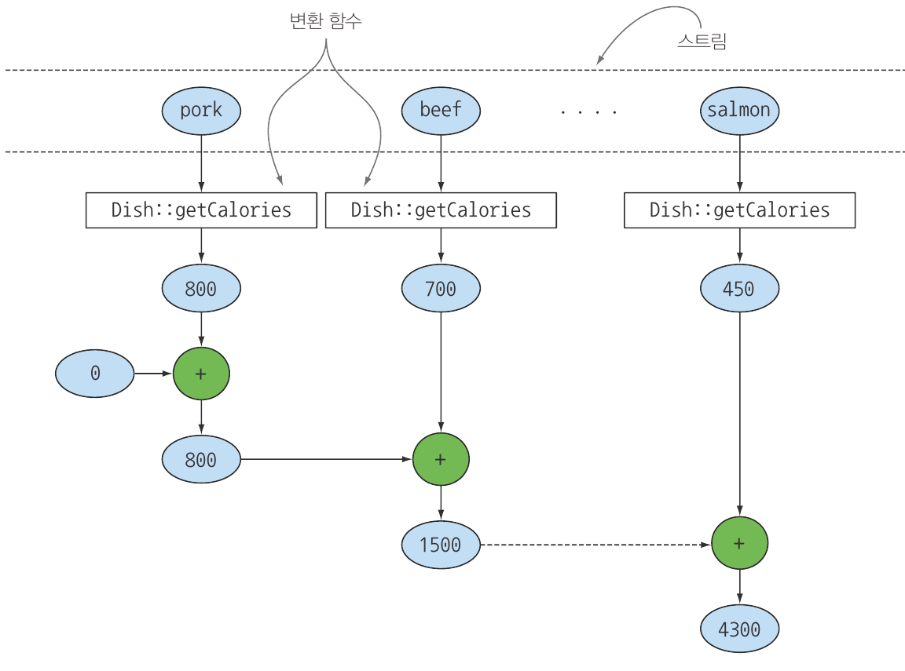

# 6. 스트림으로 데이터 수집

# 컬렉터란 무엇인가?

```java
//명령형
Map<Currency, List<Transaction>> transactionsByCurrenciesOld = new HashMap<>();

    for (Transaction transaction : transactions) {
      Currency currency = transaction.getCurrency();
      List<Transaction> transactionsForCurrency = transactionsByCurrenciesOld.get(currency);
      if (transactionsForCurrency == null) {
        transactionsForCurrency = new ArrayList<>();
        transactionsByCurrenciesOld.put(currency, transactionsForCurrency);
      }
      transactionsForCurrency.add(transaction);
    }

//함수형
Map<Currency, List<Transaction>> transactionsByCurrencies = transactions.stream()
        .collect(Collectors.groupingBy(Transaction::getCurrency));
```

- 두 코드를 비교 했을 때 명령형 코드는 함수형 코드에 비해 다중루프, 조건문 등 가독성과 유지보수성이 떨어진다. 반면 함수형 코드는 이해하기 쉽고 간결하게 구현 되었다.
- 다수준으로 그룹화를 수행할 떄 차이점이 더욱 두드러진다.

## 고급 리듀싱 기능을 수행하는 컬렉터

- 훌륭하게 설계된 함수형 API의 장점으로 높은 수준의 조합성과 재사용성을 꼽을 수 있다.
- collect로 결과를 수집하는 과정을 간단하고 유연한 방식으로 정의할 수 있다.
- 스트림에 collect를 호출하면 내부적으로 **리듀싱 연산**이 일어난다.
- Collector인터페스의 메서드를 어떻게 구현하느냐에 따라 스트림에 어떤 리듀싱이 연산을 수행할지 결정된다.
- 보통 함수 요소로 변환 할 때는 컬렉터를 적용하며 최종 결과를 저장하는 자료구조에 값을 누적한다

  스트림의 각 요소 → 변환함수 → 요소 추출 → 최종 결과 저장 자료구조 값 누적


## 미리 정의된 컬렉터

- Collectors에서 제공하는 메서드의 기능 구분
  1. 스트림 요소를 하나의 값으로 리듀스하고 요약
  2. 요소 그룹화
  3. 요소 분할

# 리듀싱과 요약

- 컬렉터(Stream.collect 메서드의 인수)로 스트림의 항목을 컬렉션으로 재구성 가능하다.
- 트리를 구성하는 다수준 맵, 단순한 정수 등 다양한 형식으로 결과를 도출 가능하다.

```java
long howManyDishes = menu.stream().collect(Collectors.counting());

//불필요한 과정 생략
long skipSteps_howManyDishes = menu.stream().count();
```

## 스트림 값에서 최대값과 최솟값 검색

```java
// Comparator는 두 객체를 비교하는 데 사용
Comparator<Dish> dishCaloriesComparator =
    Comparator.comparingInt(Dish::getCalories);

//최댓값
Optional<Dish> mostCalorieDish = menu.stream()
    .collect(maxBy(dishCaloriesComparator));
```

- 컬렉션이 아무런 요소도 가지고 있지 않다면 값을 반환 받을 수 없다. 이런 경우를 위해 Java에서는 Optional이라는 특별한 컨테이너 클래스를 제공한다. 이 Optional 클래스는 값을 감싸서, 그 값이 존재하거나 존재하지 않을 수 있는 상황을 명확하게 표현할 수 있게 한다.

## 요약 연산

- 스트림에 있는 객체의 숫자 필드의 합계나 평균 등을 반환하는 연산

### summingInt

- summingInt의 인수로 전달된 함수는 객체를 int로 매핑한 컬렉터를 반환

```java
//summingInt가 collect메서드로 전달되면 요약 작업 수행
int totalCalories = menu.stream().collect(summingInt(Dish::getCalories));

long totalCaloriesLong = menu.stream().collect(summingLong(Dish::getCalories));

Double totalCaloriesDouble = menu.stream().collect(summingDouble(Dish::getCalories));
```

- summingInt 컬렉터의 누적 과정

  

  - 매핑된 각 요소의 값을 탐색하며 초깃값으로 설정되어 있는 누적자에 칼로리를 더한다.
- summingLong, summingDouble 메서드도 같은 방식으로 동작하며 각각 형식의 데이터로 요약한다는 차이만 있다.

### averagingInt

- 평균값 계산

```java
double avgCalories = menu.stream().collect(averagingInt(Dish::getCalories));

double avgCaloriesLong = menu.stream().collect(averagingLong(Dish::getCalories));
    
double avgCaloriesDouble = menu.stream().collect(averagingDouble(Dish::getCalories));
```

### summarizingInt

- 두개 이상의 연산을 한 번에 수행

```java
IntSummaryStatistics menuStatistics = menu.stream()
      .collect(summarizingInt(Dish::getCalories));

LongSummaryStatistics menuStatisticsLong = menu.stream()
    .collect(summarizingLong(Dish::getCalories));

DoubleSummaryStatistics menuStatisticsDouble = menu.stream()
    .collect(summarizingDouble(Dish::getCalories));

//SummaryStatistics로 모든 정보가 수집된다.
//IntSummaryStatistics{count=9, sum=4200, min=120, average=466.666667, max=800}
```

## 문자열 연결

### joining

- 스트림의 각 객체에 toString 메서드를 호출해서 모든 문자열을 하나의 문자열로 연결해서 반환한다.
- 내부적으로 StringBuilder를 이용해서 문자열을 하나로 만든다
- 연결된 요소 사이에 구분 문자열을 넣을 수 있도록 오버로드된 메서드도 제공한다.

```java
String shortMenu = menu.stream()
        .map(Dish::getName)
      .collect(joining());

// 구분 문자열
String shortMenuSeparator = menu.stream()
    .map(Dish::getName)
    .collect(joining(", "));
```

## 범용 리듀싱 요약 연산

### reducing

- 모든 컬렉터는 reducing 팩토리 메서드로도 정의할 수 있다.
- 범용 팩터리 메서드 대신 특화 컬렉터를 사용한 이유는 가독성과 편의성 때문이다.

```java
int totalCaloriesReducing = menu.stream()
  .collect(reducing(0, Dish::getCalories, (i, j) -> i + j));

//인수가 하나인 reducing
Optional<Dish> mostCaloriesDish = menu.stream()
    .collect(
        reducing((d1, d2) -> d1.getCalories() > d2.getCalories() ? d1 : d2)
    );
```

- reducing의 인수

    ```java
    public static <T, U> java.util.stream.Collector<T, ?, U> reducing(
    	U identity,
    	@NotNull  java.util.function.Function<? super T, ? extends U> mapper,
    	@NotNull  java.util.function.BinaryOperator<U> op
    );
    ```

  1. identity - 리듀스를 위한 식별 값(또한 입력 요소가 없을 때 반환되는 값)
  2. mapper - 각 입력 값에 적용할 매핑 함수
  3. op - 매핑된 값을 리듀스 시키는 데 사용되는 BinaryOperator<U>
- 인수가 하나인 reducing

    ```java
    public static <T> java.util.stream.Collector<T, ?, java.util.Optional<T>> reducing(     java.util.function.BinaryOperator<T> op );
    ```

  1. op - 입력 요소를 리듀스 할 때 사용되는 BinaryOperator<T>입니다.
  - identity 를 첫 번째 인수로 받고 자신을 그대로 반환하는 **항등** **함수**를 두 번째 인수로 받는 상황에 해당한다. 즉, 시작값이 없으므로 Optional객체를 반환한다.

### 컬렉션 프레임워크 유연성 : 같은 연산도 다양한 방식으로 수행할 수 있다.

- 람다 표현식 대신 Integer 클래스의 sum 메서드를 참조하여 단순화

```java
int totalCalories = menu.stream()
	.collect(reducing(0, Dish::getCalories, Integer::sum));
```

- 리듀싱 과정

  

  1. 누적자를 초깃값으로 초기화
  2. 합계 함수를 이용해 각 요소에 변환 함수를 적용한 결과를 반복적으로 조합.
- 스트림을 IntStream으로 매핑한 다음에 sum 메서드 호출

```java
int totalCalories = menu.stream()
 .mapToInt(Dish::getCalories).sum();
```

- 이렇게 같은 연산을 다양한 방법으로 수행할 수 있다.

### 상황에 맞는 최적의 해법 선택

- 스트림 인터페이스 제공 메서드: 컬렉터에 비해 복잡도가 낮음
- 컬렉터: 코드가 좀 더 복잡한 대신 재사용성과 커스터마이즈 가능성을 제공하는 높은 수준 추상화와 일반화를 얻음
- 문제를 해결할 수 있는 다양한 해결 방법을 확인한 다음 가장 일반적으로 문제에 특화된 해결책을 고르는 것이 바람직하다. 이렇게 해서 가독성과 성능을 모두 잡을 수 있다.

**예제**

```java
int totalCalories = menu.stream()
 .mapToInt(Dish::getCalories).sum();
```

- 전체 칼로리를 계산한다 가정할 때 위 코드는 가독성이 좋고 간결하며 IntStream 덕분에 자동 언박싱연산을 수행하거나 Integer를 int로 변환하는 과정을 피할 수 있으므로 성능도 챙길 수 있다.

# 그룹화

- 데이터 집합을 하나 이상의 특성으로 분류해서 그룹화

### groupingBy

```java
Map<DishType, List<Dish>> dishesByType = menu.stream()
	.collect(groupingBy(Dish::getType));

// 람다 표현식으로 그룹화 구현
Map<CaloricLevel, List<Dish>> dishesByCaloricLevel = menu.stream()
    .collect(groupingBy(dish -> {
      if (dish.getCalories() <= 400) return CaloricLevel.DIET;
      else if (dish.getCalories() <= 700) return CaloricLevel.NORMAL;
      else return CaloricLevel.FAT;
    }));
```

- 자바 8의 합수형을 이용해 가독성 있는 코드로 그룹화를 구현 가능하다.
- 함수를 기준으로 스트림이 그룹화되므로 **분류 함수**라고 부른다
- 그룹화로 스트림 분류 과정

  

  - 그룹화 연산의 결과로 그룹화 함수가 반환하는 키 그리고 키에 대응하는 스트림의 모든 항목 리스트를 갖는 맵이 반환된다.
- 단순한 속성 접근자 대신 더 복잡한 분류 기준이 필요하면 메서드 참조를 분류 함수로 사용 불가능하기 때문에 함다 표현식으로 필요한 로직을 구현할 수 있다.

## 그룹화된 요소 조작

```java
Map<DishType, List<Dish>> highCaloricDishesByType = menu.stream()
        .filter(dish -> dish.getCalories() < 500)
      .collect(groupingBy(Dish::getType));

//두번째 Collector 안으로 필터 프레디케이트 이동
Map<DishType, List<Dish>> caloricDishesByType = menu.stream()
    .collect(groupingBy(Dish::getType,
        filtering(dish -> dish.getCalories() > 500, toList())));
```

- 모든 DishType의 결과를 유지해야 한다고 가정했을때 filter메소드가 groupingBy 이전에 호출되어서 만족하는 조건이 없을경우 해당 키 자체가 사라졌다. 두 번째 방법으로 filtering() 컬렉터가 grouping내부에서 사용되게 하여 문제를 해결 할 수 있다.
- 이 두 가지 방법은 필터링 조건에 대해 다른 결과를 생성하므로. 결과를 어떻게 표현하고 싶은지, 결과에서 어떤 정보를 보여줄지에 따라 각 방법의 장단점을 고려해서 선택 해야한다.

### filtering

- filtering() 은 스트림의 각 요소를 필터링하여 원하는 조건에 부합하는 요소들만 특정 방식으로 수집할 수 있다.
- 인수
  1. 첫번째 매개변수는 프레디케이트로, 스트림의 각 요소에 적용된다.
  2. 두번째 매개변수는 다른 Collector로, 프레디케이트가 참인 결과 요소들만 수집한다.

```java
Map<DishType, List<Dish>> caloricDishesByType = menu.stream()
        .collect(
            groupingBy(
                Dish::getType,
                filtering(
                    dish -> dish.getCalories() > 500,
                    toList()
                )
            ));
```

### mapping

- mapping()은 입력 스트림의 각 요소를 원하는 형태로 변환(매핑)하고, 그 변환된 요소들을 원하는 방식으로 수집할 수 있도록 한다.
- 인수
  1. 첫 번째 매개변수는 매핑 함수로, 스트림의 각 요소에 적용된다.
  2. 두 번째 매개변수는 다른 Collector로, 매핑 함수가 반환한 결과를 수집한다.

```java
Map<DishType, List<String>> dishNamesByType = menu.stream()
        .collect(groupingBy(Dish::getType, mapping(Dish::getName, toList())));
```

### flatMap

- flatMapping()은 '매핑'과 '평면화'라는 두 가지 스트림 연산을 결합하는 메서드입니다. 그 결과로, 스트림의 각 요소를 여러 개의 결과로 '분해'하고, 이들을 하나의 '평탄화된' 스트림으로 만듭니다.
- 인수
  1. 첫 번째 매개변수는 함수로, 스트림의 각 요소에 적용됩니다. 이 함수는 스트림의 각 요소를 스트림으로 변환합니다. 즉, 각 요소를 여러 요소로 분해합니다. 이 때 이 '분해'는 조건에 따라 비어있는 스트림일 수 있습니다.
  2. 두 번째 매개변수는 컬렉터로, 변환 및 평면화된 요소들을 수집하는 데 사용됩니다.

    ```java
    return Map.of(
            "pork", List.of("greasy", "salty"),
            "beef", List.of("salty", "roasted"),
            "chicken", List.of("fried", "crisp"),
            "french fries", List.of("greasy", "fried"),
            "rice", List.of("light", "natural"),
            "season fruit", List.of("fresh", "natural"),
            "pizza", List.of("tasty", "salty"),
            "prawns", List.of("tasty", "roasted"),
            "salmon", List.of("delicious", "fresh")
        );
    
    Map<DishType, Set<String>> dishNamesByType = menu.stream()
            .collect(
                groupingBy(Dish::getType,
                    flatMapping(
                        dish -> dishTags.get(dish.getName()).stream(),
                        toSet()
                    )
                )
            );
    
    // dishNamesByType = {MEAT=[salty, greasy, roasted, fried, crisp], OTHER=[salty, greasy, natural, light, tasty, fresh, fried], FISH=[roasted, tasty, fresh, delicious]}
    ```


## 다수준 그룹화

- 두 인수를 받는 팩토리 메서드 Collectors.groupingBy를 이용해 항목을 다수준으로 그룹화 가능하다.

```java
Map<DishType, Map<CaloricLevel, List<Dish>>> dishesByTypeCaloricLevel = menu.stream()
    .collect(
        groupingBy(Dish::getType,
            groupingBy(MultiLevelGroupingBy::getCaloricLevel)
        )
    );

private CaloricLevel getCaloricLevel(Dish dish) {
  if (dish.getCalories() <= 400) return CaloricLevel.DIET;
  else if (dish.getCalories() <= 700) return CaloricLevel.NORMAL;
  else return CaloricLevel.FAT;
}

key = FISH
value = {DIET=[Dish(name=prawns, vegetarian=false, calories=300, type=FISH)], NORMAL=[Dish(name=salmon, vegetarian=false, calories=450, type=FISH)]}
```

- 바깥쪽 groupingBy 메서드에 스트림의 항목을 분류할 두 번째 기준을 정의하는 내부 groupingBy를 전달해 두 수준으로 스트림 항목 그룹화 가능하다.
- 다수준 그룹화 연산은 다양한 수준으로 확장할 수 있으며, n수준 그룹화의 결과는 n수준 트리 구조로 표현되는 n수준 맵이 된다.


## 서브그룹으로 데이터 수집

- 첫 번째 groupingBy로 넘겨주는 컬렉터의 형식은 제한이 없다.
- 분류 함수 한 개의 인수를 같는 groupingBy( f )는 (f, ToList())의 축약형이다.

```java
Map<DishType, Long> typesCount = menu.stream()
        .collect(groupingBy(Dish::getType, counting()));

{FISH=2, MEAT=3, OTHER=4}

Map<DishType, Optional<Dish>> mostCaloricByType = menu.stream()
        .collect(groupingBy(Dish::getType, maxBy(comparingInt(Dish::getCalories))));

{
	FISH=Optional[Dish(name=salmon, vegetarian=false, calories=450, type=FISH)],
	MEAT=Optional[Dish(name=pork, vegetarian=false, calories=800, type=MEAT)],
	OTHER=Optional[Dish(name=pizza, vegetarian=true, calories=550, type=OTHER)]
}
```

### 컬렉터 결과를 다른 형식에 적용하기

### collectingAndThen

- collectingAndThen()은 '수집 후 변환' 이라는 개념을 나타냅니다. 먼저 원하는 방식으로 데이터를 수집한 다음, 수집된 결과를 원하는 형태로 추가 변환합니다
- 인수
  1. 첫 번째 인수는 원래의 Collector로, 스트림에서 수집 작업을 수행합니다.
  2. 두 번째 인수는 변환 함수로, 첫 번째 Collector가 수집한 결과에 적용됩니다.

```java
Map<DishType, Dish> mostCaloricByType_CollectingAndThen = menu.stream()
        .collect(
            groupingBy(
                Dish::getType,
                collectingAndThen(
                    maxBy(comparingInt(Dish::getCalories)),
                    Optional::get
                )
            )
        );

{
	FISH=Dish(name=salmon, vegetarian=false, calories=450, type=FISH),
	MEAT=Dish(name=pork, vegetarian=false, calories=800, type=MEAT),
	OTHER=Dish(name=pizza, vegetarian=true, calories=550, type=OTHER)
}
```


1. 컬렉터는 점선으로 표시, groupingBy는 가장 바깥쪽에 위치하면서 요리의 종류에 따라 메뉴 스트림을 세 개의 서브 스트림으로 그룹화
2. groupingBy 컬렉터는 collectingAndTehn 컬렉터를 감싸 두 번째 컬렉터는 그룹화된 세 개의 서브스트림에 적용된다.
3. collectingAndTehn 컬렉터는 세 번째 컬렉터 maxBy를 감싼다.
4. 리듀싱 컬렉터가 서브스트림에 연산을 수행한 결과에 collectingAndTehn 의 Optional::get 변환 함수가 적용된다.
5. groupingBy 컬렉터가 반환하는 맵의 분류 키에 대응하는 세 값이 각각의 요리 형식에서 가장 높은 칼로리다.

### groupingBy와 함께 사용하는 다른 컬렉터 예제

```java
Map<DishType, Integer> totalCaloriesByType = menu.stream()
        .collect(
            groupingBy(
                Dish::getType,
                summingInt(Dish::getCalories)
            )
        );

  System.out.println("totalCaloriesByType = " + totalCaloriesByType);

//각 요리 형식에 존재하는 CaloricLevel을 찾는다.
//mapping
Map<DishType, Set<CaloricLevel>> caloricLevelsByType = menu.stream()
    .collect(
        groupingBy(
            Dish::getType,
            mapping(
                CaloricLevel::getCaloricLevel,
                toSet()
            )
        )
    );

//toCollection
Map<DishType, Set<CaloricLevel>> caloricLevelsByType_toCollection = menu.stream()
    .collect(
        groupingBy(
            Dish::getType,
            mapping(
                CaloricLevel::getCaloricLevel,
                toCollection(HashSet::new)
            )
        )
    );
```

# 분할

- 분할은 **분할 함수**라 불리는 프레디케이트를 분류 함수로 사용하는 특수한 그룹화 기능이다.
- 분할 함수는 불리언을 반환하므로 맵의 키 형식은 Boolean이다. 결과적으로 그룹화 맵은 최대 (true/false) 두 개의 그룹으로 분류된다.

### **partitioningBy**

- partitioningBy 메서드는 주어진 조건에 따라 스트림을 두 부분으로 분류하는 동시에, 각 파티션별로 추가적인 수집 작업을 수행할 수 있게 합니다. 이는 복잡한 수집 요구사항을 처리하는 데 유용합니다.

```java
//모든 요리를 채식 요리와 아닌 요리로 구분
    Map<Boolean, List<Dish>> partitionedMenu = menu.stream()
      .collect(partitioningBy(Dish::isVegetarian));

//참값의 키로 맵에서 모든 채식 요리를 가져옴
List<Dish> vegetarianDishes = partitionedMenu.get(true);

//메뉴 리스트로 생성한 스트림을 프레디케이트로 필터링한 다음에 별도의 리스트에 결과 수집
List<Dish> vegetarianDishes_filter = menu.stream()
    .filter(Dish::isVegetarian)
    .collect(toList());
```

- Collectors.partitioningBy(Predicate<? super T> predicate): 이 함수는 하나의 매개변수를 받습니다. 이 매개변수는 Predicate 함수형 인터페이스로, 스트림의 각 요소에 적용되는 조건을 지정합니다. 결과적으로 맵은 true와 false 키에 해당하는 요소들의 리스트를 담고 있게 됩니다.

## 분할의 장점

- 분할 함수가 반환하는 참, 거짓 두 요소의 스트림 리스트를 모두 유지한다는 것

```java
//오버로드된 partitioningBy
Map<Boolean, Map<DishType, List<Dish>>> vegetarianDishesByType = menu.stream()
    .collect(
        partitioningBy(Dish::isVegetarian, // 분할 함수
            groupingBy(Dish::getType) // 두 번째 컬렉터
        )
    );

{
  false={
    FISH=[
      Dish(name=prawns, vegetarian=false, calories=300, type=FISH),
      Dish(name=salmon, vegetarian=false, calories=450, type=FISH)
    ],
    MEAT=[
      Dish(name=pork, vegetarian=false, calories=800, type=MEAT),
      Dish(name=beef, vegetarian=false, calories=700, type=MEAT),
      Dish(name=chicken, vegetarian=false, calories=400, type=MEAT)
    ]
  },
  true={
    OTHER=[
      Dish(name=french fries, vegetarian=true, calories=530, type=OTHER),
      Dish(name=rice, vegetarian=true, calories=350, type=OTHER),
      Dish(name=season fruit, vegetarian=true, calories=120, type=OTHER),
      Dish(name=pizza, vegetarian=true, calories=550, type=OTHER)
    ]
  }
}

//채식 요리와 채식이 아닌 요리의 가각 그룹에서 가장 칼로리가 높은 요리
Map<Boolean, Dish> mostCaloricPartitionedByVegetarian = menu.stream()
    .collect(
        partitioningBy(Dish::isVegetarian,
                collectingAndThen(
                    maxBy(comparingInt(Dish::getCalories)),
                    Optional -> Optional.get()
                )
            )
    );
```

- 오버로드된 Collectors.partitioningBy(Predicate<? super T> predicate, Collector<? super T,A,D> downstream): 이 함수는 두 개의 매개변수를 받습니다. 첫 번째 매개변수는 위와 동일한 Predicate이며, 두 번째 매개변수는 또 다른 Collector입니다.
- 세부 수집 과정을 더욱 잘 제어하려는 목적으로 제공되며, 보다 복잡한 분류 작업을 수행할 수 있게 해줍니다. downstream 매개변수(두 번째 매개변수)는 각 파티션내의 요소들에게 추가적인 수집 작업을 정의합니다.

## 숫자를 소수와 비소수로 분할하기

```java
public boolean isPrime(int candidate) {
  int candidateRoot = (int) Math.sqrt((double) candidate);
  return IntStream.range(2, candidate).noneMatch(i -> candidate % i == 0);
}
  
public Map<Boolean, List<Integer>> partitionPrimes(int n) {
  return IntStream.rangeClosed(2, n).boxed().collect(
      partitioningBy(candidate -> isPrime(candidate))
  );
}
```

- 소수의 대상을 주어진 수의 제곱근 이하의 수로 제한
- 주어진 수가 소수인지 아닌지 판단
- n개의 숫자를 포함하는 스트림 구현
- isPrime 메서드를 프레디케이드로 이용해 partitioningBy 컬렉터로 리듀스

### Collectors 클래스의 정적 팩토리 메서드


# Collector 인터페이스

- collector 인터페이스는 리듀싱 연산(컬렉터)을 어떻게 구현할지 제공하는 메서드 집합으로 구성된다.

```java
public interface Collector<T, A, R> {
    Supplier<A> supplier();
    BiConsumer<A, T> accumulator();
    BinaryOperator<A> combiner();
    Function<A, R> finisher();
    Set<Characteristics> characteristics();
}
```

- 인수
  1. T : 수집될 스트림 항목의 제네릭 형식
  2. A : 누적자, 수집 과정에서 중간 결과를 누적하는 객체의 형식
  3. R : 수집 연산 결과 객체의 형식(대개 컬렉션)

## Collector 인터페이스의 메서드

```java
//Stream<T>의 모든 요소를 List<T> 로 수집
public class ToListCollector<T> implements Collector<T, List<T>, List<T>>
```

### Supplier 메서드 : 새로운 결과 컨테이너 만들기

- supplier 메서드는 빈 결과로 이루어진 Supplier를 반환해야 한다.
- supplier는 수집 과정에서 빈 누적자 인스턴스를 만드는 파라미터가 없는 함수이다.
- ToListCollector처럼 누적자를 반환하는 컬렉터에서는 빈 누적자가 비어있는 스트림의 수집 과정의 결과가 될 수 없다.

```java
public Supplier<List<T>> supplier() {
	return () -> new ArrayList<T>();
}

//생성자 참조 전달
public Supplier<List<T>> supplier() {
	return ArrayList::new;
}
```

### accumualator 메서드 : 결과 컨테이너에 요소 추가하기

- accumualator 메서드는 리듀싱 연산을 수행하는 함수를 반환한다.
- 스트림에서 n번째 요소를 탐색할 때 누적자와 n번째 요소를 함수에 적용
- 요소를 탐색하면서 적용하는 함수에 의해 누적자 내부상태가 바뀌므로 누적자가 어떤 값일지 단정할 수 없다.
- ToListCollector에서 accumualator가 반환하는 함수는 이미 탐색한 항목을 포함하는 리스트에 현재 항목을 추가하는 연산을 수행한다.

```java
public BiConsumer<List<T>, T> accumualator() {
	return (list, item) -> list.add(item);
}

//메서드 참조
public Biconsumer<List<T>, T> accumualator() {
	return List::add
}
```

### finisher 메서드 : 최종 변환값을 결과 컨테이너로 적용하기

- finisher 메서드는 스트림 탐색을 끝내고 누적자 객체를 최종 결과로 변환하면서 누적 과정을 끝낼 때 호출할 함수를 변환해야 한다.
- 때로는 ToListCollector에서 볼 수 있는 것처럼 누적자 객체가 이미 최종 결과인 상황도 있다. 이런 떄는 변환 과정이 필요하지 않으므로 finisher 메서드는 항등 함수를 반환한다.

```java
public Function<List<T>, List<T>> finisher() {
	return Function.identity();
}
```

### 순차 리듀싱 과정의 논리적 순서


### combiner 메서드 : 두 결과 컨테이너 병합

- combiner는 리듀싱 연산에서 사용할 함수를 반환한다.
- 스트림의 서로 다른 서브파트를 병렬로 처리할 때 누적자가 이 결과를 어떻게 처리할지 정의한다.
- toList()의 combiner는 스트림의 두 번째 서브파트에서 수집한 항목 리스트를 첫 번째 서브파트 결과 리스트의 뒤에 추가하면 된다.

```java
public BinaryOperator<List<T>> combiner() {
	return(list1, list2) -> {
		list1.addAll(list2);
		return list1;	
	}
}
```

- 병렬화 리듀싱 과정에서 combiner 메서드 활용


- 스트림을 분할해야 하는지 정의하는 조건이 거짓으로 바뀌기 전까지 원래 스트림을 재귀적으로 분할한다.
  - 보통 분산된 작업의 크기가 너무 작아지면 병렬 수행 속도는 순차 수행의 속도보다 느려진다. 즉 병렬 수행의 효과가 상쇄된다. 일반적으로 프로세싱 코어의 개수를 초과하는 병렬 작업은 효율적이지 않다.
- 모든 서브스트림의 각 요소에 리듀싱 연산을 순차적으로 적용해서 서브스트림을 병렬로 처리할 수 있다.
- 컬렉터의 combiner메서드가 반환하는 함수로 모든 부분결과를 쌍으로 합친다. 즉 분할된 모든 서브스트림의 결과를 합치면서 연산이 완료된다.

### characteristics 메서드

- characteristics메서드는 컬렉터의 연산을 정의하는 Characteristics 형식의 불변 집합을 반환한다.
- 스트림을 병렬로 리듀스할 것인지 그리고 병렬로 리듀스한다면 어떤 최적화를 선택해야 할지 힌트를 제공한다.
- Characteristics는 세 항목을 포함하는 열거형이다.
  - UNORDERED : 리듀싱 결과는 스트림 요소의 방문 순서나 누적 순서에 영향을 받지 않는다.
  - CONCURRENT : 다중 스레드에서 accumulator 함수를 호출할 수 있으며 이 컬렉터는 스트림의 병렬 리듀싱을 수행할 수 있다. 컬렉터의 플래그게 UNORDERED를 함께 설정하지 않았다면 데이터 소스가 정렬되어 있지 않은 상황(집합처럼 요소의 순서가 무의미한 상황)에서만 병렬 리듀싱을 수행할 수 있다.
  - IDENTITY_FINISH : finisher 메서드가 반환하는 함수는 단순히 identity를 적용할 뿐이므로 이를 생략할 수 있다. 따라서 리듀싱 과정의 최종 결과로 누적자 객체를 바로 사용할 수 있다. 또한 누적자 A를 결과 R로 안전하게 형변환할 수 있다.
- ToListCollector에서 스트림의 요소를 누적하는데 사용한 리스트가 최종 결과 형식이므로 추가 변환이 필요 없다. 따라서 ToListCollector는 IDENTITY_FINISH다. 하지만 리스트의 순서는 상관이 없으므로 UNORDERED다. 마지막으로 ToListCollector는 CONCURRENT다. 하지만 요소의 순서가 무의미한 데이터 소스여야 병렬로 실행할 수 있다.

## 응용하기

### 커스텀 ToListCollector 구현

```java
public class ToListCollector<T> implements Collector<T, List<T>, List<T>> {

    @Override
    public Supplier<List<T>> supplier() {
        return ArrayList::new; // 수집 연산의 시발점
    }

    @Override
    public BiConsumer<List<T>, T> accumulator() {
        return List::add; // 탐색한 항목을 누적하고 바로 누적자를 고친다.
    }

    @Override
    public BinaryOperator<List<T>> combiner() {
        return (list1, list2) -> { // 두 번째 인수인 누적자를 첫 번째 누적자에 적용한다.
            list1.addAll(list2); // 변경된 첫 번째 누적자를 반환한다.
            return list1;
        };
    }

    @Override
    public Function<List<T>, List<T>> finisher() {
        return Function.identity(); // 항등 함수
    }

    @Override
    public Set<Characteristics> characteristics() {
        return Collections.unmodifiableSet(
            EnumSet.of(Characteristics.IDENTITY_FINISH, Characteristics.CONCURRENT)
        ); // 컬렉터의 플래그를 IDENTITY_FINISH와 CONCURRENT로 설정한다.
    }
}

//커스텀 collector 적용
List<Dish> dishes = menuStream.collect(new ToListCollector<Dish>());

//기존 코드
List<Dish> dishes = menuStream.collect(toList());

```

- 기존 코드의 toList는 팩토리지만 ToListCollector는 new로 인스턴스화 한다는 점이 다르다.

### 컬렉터 구현을 만들지 않고 커스텀 수집 수행

- IDENTITY_FINISH 수집 연산에서는 Collector 인터페이스를 완전히 새로 구현하지 않고도 같은 결과를 얻을 수 있다.
- Stream은 세 함수(발행, 누적, 합침)를 인수로 받는 collect 메서드를 오버로드하며 각각의 메서드는 Collector 인터페이스의 메서드가 반환하는 함수와 같은 기능을 수행한다.

```java
List<Dish> dishes = menuStream.collect(
	ArrayList::new, // 발행
	List::add, //누적
	List::addAll // 합침
);
```

- 컬렉터를 구현한 코드에 비해 좀 더 간결하고 축약되어 보이나 가독성은 떨어진다.
- 적절한 클래스로 커스텀 컬렉터를 구현하는 편이 중복을 피하고 재사용성을 높이는데 도움이 된다.
- 이 메서드로는 Characteristics를 전달할 수 없다. 즉, IDENTITY_FINISH와 CONCURRENT 지만 UNORDERED 는 아닌 컬렉터로만 동작한다.

# 커스텀 컬렉터를 구현해서 성능 개선하기

```java
public boolean isPrime(int candidate) {
  int candidateRoot = (int) Math.sqrt((double) candidate);
  return IntStream.range(2, candidate).noneMatch(i -> candidate % i == 0);
}
```

### 소수로만 나누기

- 소수로 나누어떨어지는지 확인해서 대상의 범위를 좁힐 수 있다.
- 제수가 소수가 아니면 소용이 없으므로 제수를 현재 숫자 이하에서 발견한 소수로 제한할 수 있따.
- 주어진 숫자가 소수인지 아닌지 판단 하기위해 소수 리스트에 접근해야 하나 기존 컬렉터로는 수집 과정에서 부분결과에 접근이 불가능하다.
- 커스텀 컬렉터 클래스로 문제를 해결한다.

```java
//중간 결과 리스트가 있다면 isPrime 메서드로 중간 결과 리스트를 전달하도록 코드 구현
public boolean isPrime(List<Integer> primes, int candidate) {
  return primes.stream().noneMatch(i -> candidate % i == 0)
}

//숫자의 제곱근보다 작은 소수만 사용하도록 코드 최적화 즉, 다음 소수가 대상의 루트보다 크면 소수로 나누는 검사 중지
//대상의 제곱보다 큰 소수를 찾으면 검사를 중단하도록 구현
public boolean isPrime(List<Integer> primes, int candidate) {
	int candidateRoot = (int) Math.sqrt((double) candidate);
  return primes.stream()
	.takeWhile(i -> i <= candidateRoot)
	.noneMatch(i -> candidate % i == 0)
}
```

### 1단계 : Controller 클래스 시그니처 정의

```java
public class PrimeNumbersCollector implements
	Collector<
		Integer, // 스트림 요소 형식
		Map<Boolean, List<Integer>>, // 누적자 형식
		Map<Boolean, List<Integer>> // 수집 연산의 결과 형식
	>
```

### 2단계: 리듀싱 연산 구현

```java
// 누적자를 만드는 함수 반환
public Supplier<Map<Boolean, List<Integer>>> supplier() {
    return () -> new HashMap<Boolean, List<Integer>> () {{
        put(true, new ArrayList<Integer>());
        put(false, new ArrayList<Integer>());
    }};
}

public BiConsumer<Map<Boolean, List<Integer>>, Integer> accumulator() {
	return (Map<Boolean, List<Integer>> acc, Integer candidate) -> {
		acc.get(isPrime(acc.get(true), candidate)) // isPrime 결과에 따라 소수, 비소수 구분
		.add(candidate); // candidate를 알맞은 리스트에 추가
	};
}
```

### 3단계 : 가능하다면 병렬 실행할 수 있는 컬렉터 만들기

```java
public BinaryOperator<Map<Boolean, List<Integer>>> combiner() {
	return (Map<Boolean, List<Integer>> map1, Map<Boolean, List<Integer>> map2) -> {
		map1.get(true).addAll(map2.get(true));
		map1.get(false).addAll(map2.get(false));
		return map1;
	};
}
```

### 4단계 : finisher 메서드와 컬렉텅늬 characteristics 메서드

```java
public Function<Map<Boolean, List<Integer>>, Map<Boolean, List<Integer>>> finisher() {
  return Function.identity();
}

public Set<Characteristics> characteristics() {
  return Collections.unmodifiableSet(EnumSet.of(Characteristics.IDENTITY_FINISH));
}
```

### 최종 구현코드

```java
public class PrimeNumbersCollector implements Collector<Integer, Map<Boolean, List<Integer>>, Map<Boolean, List<Integer>>> {
    @Override
    public Supplier<Map<Boolean, List<Integer>>> supplier() {
        return () -> new HashMap<Boolean, List<Integer>> () {{ 
            put(true, new ArrayList<Integer>());
            put(false, new ArrayList<Integer>());
        }};
    }
		//두 개의 빈 리스트를 포함하는 맵으로 수집 동작 시작.

    @Override
    public BiConsumer<Map<Boolean, List<Integer>>, Integer> accumulator() {
        return (Map<Boolean, List<Integer>> acc, Integer candidate) -> {
            acc.get(isPrime(acc.get(true), candidate)).add(candidate);
        };
    }

    @Override
    public BinaryOperator<Map<Boolean, List<Integer>>> combiner() {
        return (Map<Boolean, List<Integer>> map1, Map<Boolean, List<Integer>> map2) -> {
            map1.get(true).addAll(map2.get(true));
            map1.get(false).addAll(map2.get(false));
            return map1;
        };
    }

    @Override
    public Function<Map<Boolean, List<Integer>>, Map<Boolean, List<Integer>>> finisher() {
        return Function.identity(); 
				// 최종 수집 과정에서 데이터 변환이 필요하지 않으므로 항등 함수 반환
    }

    @Override
    public Set<Characteristics> characteristics() {
        return Collections.unmodifiableSet(EnumSet.of(Characteristics.IDENTITY_FINISH));
    }
		//발견한 소수의 순서에 의마가 있으므로 컬렉터는 IDENTITY_FINISH지만 UNOREDERED,CONCURRENT는 아니다.

    public boolean isPrime(List<Integer> primes, int candidate) {
        int candidateRoot = (int) Math.sqrt((double) candidate);
        return primes.stream()
                .takeWhile(i -> i <= candidateRoot)
                .noneMatch(i -> candidate % i == 0);
    }
}
```

# 마무리

- collect는 스트림의 요소를 요약 결과로 누적하는 다양한 방법(컬렉터)을 인수로 갖는 최종 연산이다.
- 스트림의 요소를 하나의 값으로 리듀스하고 요약하는 컬렉터뿐 아니라 최댓값, 최솟값 평균값을 계산하는 컬렉터 등이 미리 정의되어 있다.
- 미리 정의된 컬렉터인 groupingBy로 스트림의 요소를 그룹화하거나, partitioningBy로 스트림의 요소를 분할할 수 있다.
- 컬렉터는 다수준의 그룹화, 분할, 리듀싱 연산에 적합하게 설계되어 있다.
- Collector 인터페이스에 정의된 메서드를 구현해서 커스텀 컬렉터를 개발할 수 있다.