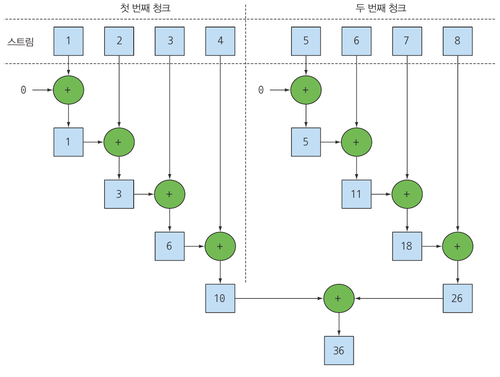
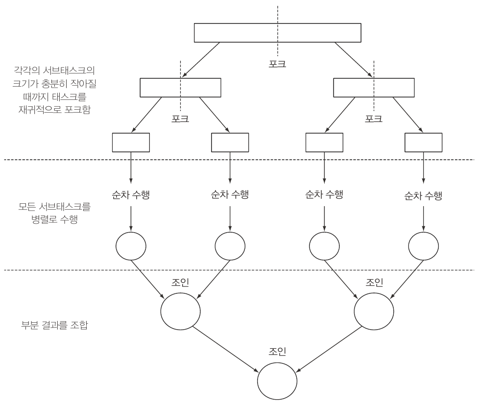
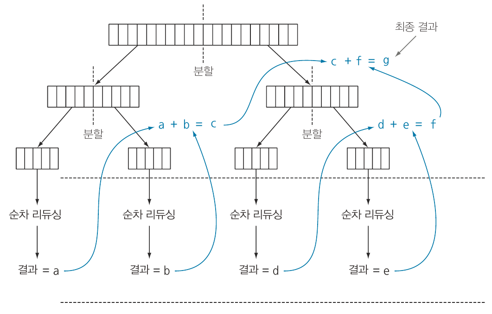
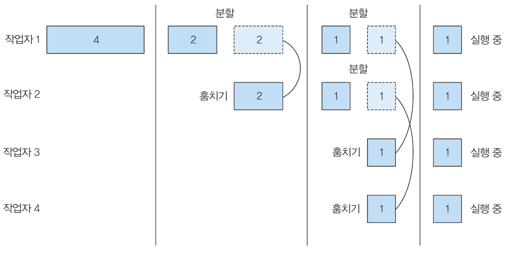
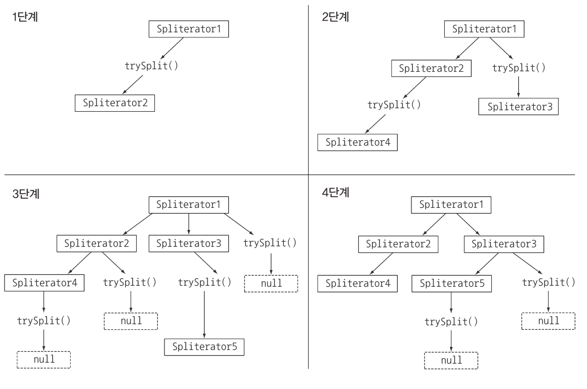
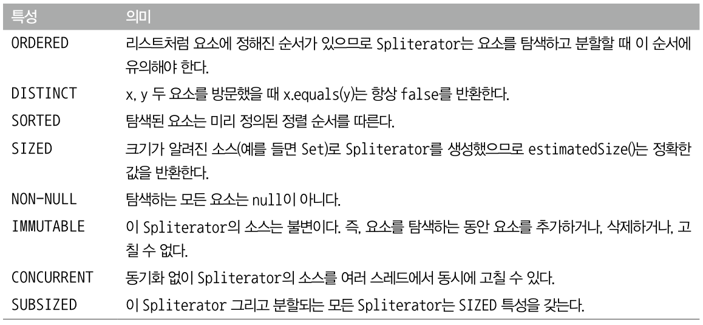

# 7. 병렬 데이터 처리와 성능

- 자바7의 등장 이전에는 데이터 컬렉션을 병렬로 처리하기 어려웠다.
- 데이터를 서브파트로 분할하고 스레드로 할당하고 레이스 컨디션이 발생하지 않도록 적절한 동기화를 추가하며, 부분 결과를 합치는 과정을 거쳐야 했다.
- 자바7이 등장하며 병렬화를 수행하면서 에러를 최소화 할 수 있도록 **포크/조인 프레임워크** 기능을 제공한다.
- 스트림을 이용하면 순자 스트림을 병렬 스트림으로 자연스럽게 변경 가능하다.

# 병렬 스트림

- 컬렉션에 paralleStream을 호출하면 **병렬 스트림**이 생성된다.
- 병렬 스트림이란 각각의 스레드에서 처리할 수 있도록 스트림의 요소를 여러 청크로 분할한 스트림니이다.
- 병렬 스트림을 이용하면 모든 멀티코어 프로세서가 각각의 청크를 처리하도록 할당할 수 있다.

## 순차 스트림을 병렬 스트림으로 변환하기

```java
//순차 스트림
  public static long sequentialSum(long n) {
    return Stream.iterate(1L, i -> i + 1)
        .limit(n)
        .reduce(0L, Long::sum);
  }

//반복문
public static long iterativeSum(long n) {
  long result = 0;
  for (long i = 1L; i <= n; i++) {
    result += i;
  }
  return result;
}
  
//병렬 스트림
public static long parallelSum(long n) {
  return Stream.iterate(1L, i -> i + 1)
      .limit(n)
      .parallel() // 스트림을 병렬 스트림으로 변환
      .reduce(0L, Long::sum);
}
```

- 병렬 리듀싱 연산

  

    - 순차 스트림에 parallel 메서드를 호출하면 기존의 함수형 리듀싱 연산 이 병렬로 처리된다.
    - 리듀싱 연산을 여러 청크에서 병렬로 실행
    - 리듀싱 연산으로 생성된 부분을 다시 리듀싱 연산으로 합쳐 전체 스트림의 리듀싱 결과 도출
- 순차 스트림에 parallel을 호출시 내부적으로 이후 연산이 병롤로 수행되되도록 불리언 플래그가 설정되며 sequential로 순차 스트림으로 설정 가능하다.
- parallel과 sequential 두 메서드 중 최종적으로 호출된 메서드가 전체 파이프라인에 영향을 미친다.

```java
stream.parallel()
			.filter()
			.sequential()
			.map()
			.parallel()
			.reduce();
```

- 스트림의 parallel 메서드에서 병렬 작업을 수행하는 스레드는 프로세서 수 값에 상응하는 스레드를 갖는다.

## 스트림 성능 측정

- 병렬화를 이용하면 순차나 반복 형식에 비해 성능이 좋아질 것이라 추측한다. 하지만 소프트웨어 공학에서 추측은 위험한 발상이다. 성능을 최적하할 때 세 가지 확금 규칙 측정, 측정, 측정을 기억하자
- JMH라이브러리를 이용해 벤치마크를 구현해 측정을 실시해보자
    - gradle

    ```java
    plugins {
        id "me.champeau.jmh" version "0.7.2"
    }
    ```

    - gradle jmh 으로 실행

```java
@BenchmarkMode(Mode.AverageTime) // 벤치마크 대상 메서드 실행하는 데 걸린 평균 시간 측정
@OutputTimeUnit(TimeUnit.MILLISECONDS) // 벤치마크 결과를 밀리초 단위로 출력
@Fork(value = 2, jvmArgs = {"-Xms4G", "-Xmx4G"}) // 2회 측정하고 각 측정 결과를 평균내어 반환
public class ParallelStreamBenchmark {
  private static final long N = 10_000_000L; // 1000만
  
  @Benchmark // 벤치마크 대상 메서드
  public long sequentialSum() {
    return Stream.iterate(1L, i -> i + 1)
        .limit(N)
        .reduce(0L, Long::sum);
  }
  
  @TearDown(Level.Invocation) // 각 벤치마크 실행 후에 실행되는 메서드
  public void tearDown() {
    System.gc(); // 가비지 컬렉터 실행
  }
}
```

### 더 특화된 메서드 사용

- 병렬 프로그래밍은 까다롭고 때로는 이해하기 어려운 함정이 숨어있다. 심지어 병렬 프로그래밍을 오용하면 오히려 전체 프로그램의 성능이 더 나빠질 수 있다.

```java
public static long parallelSumOld(long n) {
  return Stream.iterate(1L, i -> i + 1)
      .limit(n)
      .parallel()
      .reduce(0L, Long::sum);
}

//병렬 스트림 개선
public static long parallelRangedSum(long n) {
    return LongStream.rangeClosed(1, n)
        .parallel()
        .reduce(0L, Long::sum);
  }
```

- Old 코드
    - 반복 결과로 박싱된 객체가 만들어지므로 숫자를 더하려면 언박싱을 해야 한다.
    - 반복 작업은 병렬로 수행할 수 있는 독립 단위로 나누기가 어렵다.
    - 이전 연산의 결과에 따라 다음 함수의 입력이 달라지기 때문에 iterate 연산을 청크로 분할하기가 어렵다.
    - 리듀싱 과정을 시작하는 시점에 전체 숫자 리스트가 준비되지 않으므로 스트림을 병렬로 처리할 수 있도록 청크로 분할할 수 없다.
- 개선 코드
    - LongStream.rangeClosed는 기본형 long을 사용하므로 박싱과 오버헤드가 없다.
    - LongStream.rangeClosed는 쉽게 청크로 분할할 수 있는 숫자 범위를 생산한다.
    - 상황에 따라서 어떤 알고리즘을 병렬화하는 것보다 적적할 자료구조를 선택하는 것이 더 중요하다는 사실을 단적으로 보여준다.
- 공짜가 아닌 병렬화
    - 병렬화를 이용하려면 스트림을 재귀적으로 분할해야 하고,  각 서브스트림을 서로 다른 스레드의 리듀싱 연산으로 할당하고, 이 결과를 하나의 값으로 합쳐야 한다.
    - 멀티코어 간의 데이터 이동은 생각보다 비싸므로 코에 간에 데이터 전송 시간보다 훨씬 오래 걸리는 작업만 병렬 처리로 수행하는 것이 바람직하다.

## 병렬 스트림의 올바른 사용법

- 병렬 스트림을 잘못 사용하면서 발생하는 많은 문제는 공유된 상태를 바꾸는 알고리즘을 사용하기 때문에 일어난다.
- n 까지의 자연수를 더하면서 공유된 누적자를 바꾸는 프로그램

```java
public long sideEffectSum(long n) {
    Accumulator accumulator = new Accumulator();
    LongStream.rangeClosed(1, n).forEach(accumulator::add);
    return accumulator.total;
  }

public static class Accumulator {
  public long total = 0;
  public void add(long value) { total += value; }
}

//병렬 실행
public long sideEffectParallelSum(long n) {
  Accumulator accumulator = new Accumulator();
  LongStream.rangeClosed(1, n).parallel().forEach(accumulator::add);
  return accumulator.total;
}
```

- 명령형 코드
    - 누적자를 초기화하고, 리스트의 각 요소를 하나씩 탐색하며 누적자에 숫자를 추가할 수 있다.
- 병렬 코드
    - 위 코드는 본질적으로 순차 실행할 수 있도록 구현되어 있으므로 병렬로 실행시 문제가 생긴다.
    - total을 접근할 때마다(다수의 스레드에서) 데이터 레이스 문제가 발생한다.
    - 동기화로 문제를 해결하려 하다보면 결국 병렬화라는 특성이 없어져 버린다.(대기)
    - 메서드의 성능도 좋지 않으며 올바른 결과값이 나오지 않는다. 여러 스레드에서 동시에 누적자(total += value)를 실행하면서 이런 문제가 발생한다.
    - 결국 여러 스레드에서 공유하는 객체의 상태를 바꾸는 forEach 블록 내부에서 add 메서드를 호출하면서 이 같은 문제가 발생한다
- 위와 같은 문제를 피하려면 병렬 스트림을 사용했을 때 상태 공유에 따른 부작용을 피해야 한다.
- 즉 공유된 가변 상태를 피해야 한다.

### 병렬 스트림 효과적으로 사용하기

1. 확신이 서지 않는다면 직접 측정하라.
2. 박싱을 주의하라.
3. 순차 스트림보다 병렬 스트림에서 성능이 떨어지는 연산이 있다.
4. 스트림에서 수행하는 전체 파이프라인 연산 비용을 고려하라.
5. 소량의 데이터에서는 병렬 스트림이 도움 되지 않는다.
6. 스트림을 구성하는 자료구조가 적절한지 확인하라.
7. 스트림의 특정과 파이프라인의 중간 연산이 스트림의 특성을 어떻게 바꾸는지에 따라 분해 과정의 성능이 달라질 수 있다.
8. 최종 연산의 병합 과정 비용을 살펴보라.
9. 병렬 스트림이 수행되는 내부 인프라구조를 살펴보라.(포크/조인 프레임워크)

# 포크/조인 프레임워크

- 포크/조인 프레임워크는 병렬화할 수 있는 작업을 재귀적으로 작은 작업으로 분할한 다음에 서브태스크 각각의 결과를 합쳐서 전체 결과를 만들도록 설계되었다.
- 포크/조인 프레임워크에서는 서브태스크를 스레드 풀(ForkJoinPool)의 작업자 스레드에 분산 할당하는 ExecutorService 인터페이스를 구현한다.

## RecursiveTask 활용

- 스레드 풀을 이용하려면 RecursiveTask<R> 의 서브클래스를 만들어야 한다.
- R은 병렬화된 태스크가 생성하는 결과 형식 또는 결과가 없을 때(다른 비지역 구조를 바꿀 수 있다.)는 RecursiveAction형식이다.
- 추상메서드 compute를 구현해야 한다.

```java
protected abstract R compute();
```

- compute 메서드
  - 태스크를 서브태스크로 분할하는 로직과 더 이상 분할할 수 없을 때 개별 서브태스크의 결과를 생산할 알고리즘을 정의한다.
  - 대부분 compute 메서드 구현은 다음 sudo코드 형식을 의미한다.

    ```java
    if (태스크가 충분히 작거나 더 이상 분할할 수 없으면) {
    	순차적으로 태스크 계산
    } else {
    	태스크를 두 서브태스크로 분할
    	태스크가 다시 서브태스크로 분할되도록 이 메서드를 재귀적으로 호출
    	모든 서브태스크의 연산이 완료될 때까지 기다림
    	각 서브태스크의 결과를 합침
    }
    ```

  - 분할 후 정복 알고리즘 사용
    - 분할(Divide): 주어진 배열을 반으로 분할합니다. 분할은 입력 배열이 하나의 요소(즉, 정렬된 배열)를 가질 때까지 실행됩니다.
    - 정복(Conquer): 이제 이하의 단계에서 각 분할된 배열을 정복(즉, 정렬)하기 시작합니다.
    - 결합(Combine): 마지막으로, 정렬된 배열을 결합합니다. 결합 과정이 종료되면 전체 배열은 정렬된 상태가 됩니다.
- 포크/조인 과정



- 포크/조인 프레임워크를 이용해 병렬 합계 수행

```java
public class ForkJoinSumCalculator extends RecursiveTask<Long> { // RecursiveTask를 상속받아 포크/조인 프레임워크를 사용하는 태스크 정의
  private final long[] numbers; // 더할 숫자 배열
  private final int start; // 이 서브태스크에서 처리할 배열의 초기 위치와 최종 위치
  private final int end;
  private static final long THRESHOLD = 10_000; // 이 값 이하의 서브태스크는 더 이상 분할할 수 없음

  public ForkJoinSumCalculator(long[] numbers) { // 메인 태스크를 생성할 때 사용할 공개 생성자
    this(numbers, 0, numbers.length);
  }

  private ForkJoinSumCalculator(long[] numbers, int start, int end) { // 메인 태스크의 서브태스크를 재귀적으로 만들 때 사용할 비공개 생성자
    this.numbers = numbers;
    this.start = start;
    this.end = end;
  }

  @Override
  protected Long compute() { // RecursiveTask의 추상 메서드 오버라이드
    int length = end - start; // 이 태스크에서 더할 배열의 길이
    if (length <= THRESHOLD) {
      return computeSequentially(); // 기준 값과 같거나 작으면 순차적으로 결과를 계산
    }
    ForkJoinSumCalculator leftTask = new ForkJoinSumCalculator(numbers, start, start + length / 2); // 배열의 첫 번째 절반을 더하도록 서브태스크를 생성
    leftTask.fork();
    ForkJoinSumCalculator rightTask = new ForkJoinSumCalculator(numbers, start + length / 2, end); // ForkJoinPool의 다른 스레드로 새로 생성한 태스크를 비동기로 실행
    Long rightResult = rightTask.compute(); // 두 번째 절반을 더하도록 두 번째 서브태스크를 동기 실행
    Long leftResult = leftTask.join(); // 첫 번째 서브태스크의 결과를 읽거나 아직 결과가 없으면 기다림
    return leftResult + rightResult; // 두 서브태스크의 결과를 조합한 값이 이 태스크의 결과
  }

  private long computeSequentially() { // 더 분할할 수 없을 때 서브태스크의 결과를 계산하는 단순한 알고리즘
    long sum = 0;
    for (int i = start; i < end; i++) {
      sum += numbers[i];
    }
    return sum;
  }

}
```

- ForkJoinPool
  - 일반적으로 애플리케이션에서는 둘 이상의 ForkJoinPool을 사용하지 않는다.
  - ForkJoinPool을 한 번만 인스턴스화해서 정적 필드에 싱클턴으로 저장한다.
  - ForkJoinPool을 만들면서 디폴트 생성자를 이용해 JVM에서 이용할 수 있는 모든 프로세서가 자유롭게 풀에 접근할 수 있도록 했다.
  - 즉 실제 프로세서와, 하이퍼스레딩과 관련된 가상 프로세서가 접근 가능하다.

### ForkJoinSumCalculator 실행

1. ForkJoinSumCalculator를 ForkJoinPool로 전달하면 풀의 스레드가 ForkJoinSumCalculator의 compute 메서드를 실행하면서 작업을 수행한다.
2. compute 메서드는 병렬로 실행할 수 있을 만큼 태스크의 크기가 충분히 작아졌는지 확인하며, 아직 태스크의 크기가 크다고 판단되면 숫자 배열을 반으로 분할해서 두 개의 새로운ForkJoinSumCalculator로 할당한다.
3. 다시 ForkJoinPool이 새로 생성된 ForkJoinSumCalculator를 실행한다.
4. 위 과정을 재귀적으로 반복되면서 주어진 조건을 만족 할 때까지 태스크 분할을 반복한다.
5. 각 서브태스크는 순차적으로 처리되며 포킹 프로세스로 만들어진 이진트리의 태스크를 루트에서 역순으로 방문한다.
6. 각 서브태스크의 부분 결과를 합쳐 태스크의 최종 결과를 계산한다.



### 포크/조인 프레임워크를 제대로 사용하는 방법

- join 메서드를 태스크에 호출하면 태스크가 생산하는 결과가 준비될 때까지 호출자를 블록시킨다. 따라서 두 서브태스크가 모두 시작된 다음에 join을 호출해야 한다.
- RecursiveTask 내에서는 ForkJoinPool의 invoke 메서드를 사용하지 말아야 한다.
- 서브태스크에 fork 메서드를 호출해서 ForkJoinPool의 일정을 조절할 수 있다.
- 포크/조인 프레임워크를 이용하는 병렬 계산은 디버깅이 어렵다.
- 멀티코어에 포크/조인 프레임워크를 사용하는 것이 순차 처리보다 무조건 빠를 거라는 생각을 버려야 한다.

### 작업 훔치기 - 서브태스크 분할 기준과 관련된 힌트

- 코어 개수와 상관없이 적절한 크리고 분할된 많은 태스크를 포킹하는 것이 바람직하다.
- 작업 훔치기 기법에서는 ForkJoinPool의 모든 스레드를 거의 공정하게 분할한다.
- 각각의 스레드는 자신에게 할당된 태스크를 포함하는 이중 연결 리스트를 참조하면서 작업이 끝날 때마다 큐의 헤드에서 다른 태스크를 가져와서 작업을 처리한다.
- 이때 한 스레드는 다른 스레드보다 자신에게 할당된 태스크를 더 빨리 처리할 수 있다.
- 모든 큐가 빌 때까지 이 과정을 반복한다. 따라서 태스크의 크기를 작게 나누어야 작업자 스레드 간의 작업 부하를 비슷한 수준으로 유지할 수 있다.



- 작업자의 큐에 있는 태스크를 두 개의 서브 태스크로 분할했을 때 둘 중 하나의 태스크를 다른 유휴 작업자가 훔쳐갈 수 있다.
- 주어진 태스크를 순차 실행할 단계가 될 때까지 이 과정을 재귀적으로 반복한다.

# Spliterator 인터페이스

- Spliterator 는 분할할 수 있는 반복자 이며 Iterator처럼 소스의 요소 탐색 기능을 제공한다는 점은 같지만 Spliterator는 병렬 작업에 특화되어 있다.
- 자바8은 컬렉션 프레임워크에 포함된 모든 자료구조에 사용할 수 있는 디폴트 Spliterator 구현을 제공한다.
- 컬렉션은 spliterator라는 메서드를 제공하는 Spliterator 인터페이스를 구현한다.

```java
public interface Spliterator<T> {
	boolean tryAdvance(Consumer<? super T> action);
	Spliterator<T> trySplit();
	long estimateSize();
	int characteristics();
}
```

- T는 Spliterator에서 탐색하는 요소의 형식을 가리킨다.
- tryAdvance 메서드는 Spliterator의 요소를 하나씩 순차적으로 소비하면서 탐색해야 할 요소가 남아 있으면 참을 반환한다.(일반적인 Iterator 동작)
- trySplit 메서드는 Spliterator일부 요소(자신이 반환할 요소)를 분할해서 두 번째 Spliterator를 생성한다.
- Spliterator에서는 estimateSize 메서드로 탐색해야 할 요소 수 정보를 제공할 수 있다. 특히 탐색해야 할 요소 수가 정확하지 않더라도 제공된 값을 이용해 더 쉽고 공평하게 Spliterator를 분할할 수 있다.

## 분할 과정



- 스트림을 여러 스트림으로 분할하는 과정은 재귀적으로 일어난다.
  1. 첫 번째 Spliterator에 trySplit을 호출하면 두 번째 Spliterator가 생성된다.
  2. 두 개의 Spliterator에 trySplit를 다시 호출하면 네 개의 Spliterator가 생성된다.
  3. trySplit의 결과가  null이 될 때까지 이 과정을 반복한다.
  4. Spliterator에서 호출한 모든 trySplit의 결과가 null이면 재귀 분할 과정이 종료된다.
- trySplit이 null을 반환했다는 것은 더 이상 자료구조를 분할할 수 없음을 의미한다.
- 분할 과정은 characteristics 메서드로 정의하는 Spliterator의 특성에 영향을 받는다.

### Spliterator 특성

- Spliterator는 characteristics라는 추상 메서드도 정의한다. Characteristics 메서드는 Spliterator 자체의 특성 집합을 포함하는 int를 반환한다.
- Spliterator를 이용하는 프로그램은 이들 특성을 참고해서 Spliterator를 더 잘 제어하고 최적화할 수 있다.



## 커스텀 Spliterator 구현하기

### 반복 버전

```java
public static int countWordsIteratively(String s) {
  int counter = 0;
  boolean lastSpace = true;
  for (char c : s.toCharArray()) { // 문자열을 하나씩 탐색
    if (Character.isWhitespace(c)) {
      lastSpace = true;
    } else {
      if (lastSpace) counter++; // 단어의 첫 글자일 경우 카운터 증가
      lastSpace = false;
    }
  }
  return counter;
}
```

### 함수형으로 구현하기

```java
@Getter
@AllArgsConstructor
static class WordCounter {

  private final int counter;
  private final boolean lastSpace;

  public WordCounter accumulate(Character c) { // 문자를 하나씩 탐색할 때마다 호출
    if (Character.isWhitespace(c)) { // 공백 문자 확인
      return lastSpace ? this : new WordCounter(counter, true);
    } else {
      return lastSpace ? new WordCounter(counter + 1, false) : this; // 문자를 하나씩 탐색하다 공백 문자를 만나면 지금까지 탐색한 문자를 단어로 간주해 카운터를 증가
    }
  }

  public WordCounter combine(WordCounter wordCounter) {
    return new WordCounter(counter + wordCounter.counter, wordCounter.lastSpace);  // 두 WordCounter의 counter 값을 더함,
  }
}

private static int countWords(Stream<Character> stream) {
  WordCounter wordCounter = stream.reduce(new WordCounter(0, true), WordCounter::accumulate, WordCounter::combine);
  return wordCounter.getCounter();
}
```

### 병렬로 수행하기

```java
System.out.println("Found " + countWords(stream.parallel()) + " words");
```

- 위와 같이 실행시 원래 문자열을 임의의 위치에서 둘로 나누다보니 예상치 못하게 하나의 단어를 둘로 계산하는 상황이 발생할 수 있다.
- 즉, 순차 스트림을 병렬 스트림으로 바꿀 때 스트림 분할 위치에 따라 잘못된 결과가 나올 수 있다.
- 문자열을 단어가 끝나는 위치에서만 분할 하는 Spliterator 구현

```java
public class WordCounterSpliterator implements Spliterator<Character> {
	private final String string;
	private int currentChar = 0;
	
	public WordCounterSpliterator(String string) {
	  this.string = string;
	}
	
	@Override
	public boolean tryAdvance(java.util.function.Consumer<? super Character> action) {
	  action.accept(string.charAt(currentChar++)); // 현재 문자를 소비한다.
	  return currentChar < string.length(); // 소비할 문자가 남아있으면 true를 반환한다.
	}
	
	@Override
	public Spliterator<Character> trySplit() {
	  int currentSize = string.length() - currentChar;
	  if (currentSize < 10) { // 파싱할 문자열을 순차 처리할 수 있을 만큼 충분히 작아졌음을 알리는 null을 반환한다.
	    return null;
	  }
	  for (int splitPos = currentSize / 2 + currentChar; splitPos < string.length(); splitPos++) {
	    if (Character.isWhitespace(string.charAt(splitPos))) { // 파싱할 문자열의 중간을 분할 위치로 설정한다. 단어 중간에 분할 위치가 오지 않도록 공백을 찾는다.
	      Spliterator<Character> spliterator = new WordCounterSpliterator(string.substring(currentChar, splitPos)); // 다음 문자부터 분할 위치까지 문자열을 파싱할 새로운 WordCounterSpliterator를 생성한다.
	      currentChar = splitPos; // 이 WordCounterSpliterator의 시작 위치를 분할 위치로 설정한다.
	      return spliterator; // 공백을 찾았고 문자열을 분할할 수 있으므로 새로운 Spliterator를 반환한다.
	    }
	  }
	  return null; // 문자열을 분할할 수 없으면 null을 반환한다.
	}
	
	@Override
	public long estimateSize() {
	  return string.length() - currentChar; // 이 Spliterator가 파싱할 문자열의 남은 문자 수를 반환한다.
	}
	
	@Override
	public int characteristics() {
	  return ORDERED + SIZED + SUBSIZED + NONNULL + IMMUTABLE; // ORDERED, SIZED, SUBSIZED, NONNULL, IMMUTABLE 특성을 갖는다.
	}
}
```

- tryAdvance
  - 문자열에서 현재 인덱스에 해당하는 문자를 Consumer에 제공한 다음 인덱스를 증가시킨다.
    - 인수로 전달된 Consumer는 스트림을 탐색하면서 적용해야 하는 함수 집합이 작업을 처리할 수 있도록 소비한 문자를 전달하는 자바 내부 클래스다.
  - 새로운 커서 위치가 전체 문자열 길이보다 작으면 참을 반환하며 이는 반복 탐색해야 할 문자가 남아있음을 의미한다.
- trySplit
  - 반복될 자료구조를 분할하는 로직을 포함
  - 분할 동작을 중단할 한계를 설정한다. 실전의 애플리케이션에서는 너무 많은 태스크를 만들지 않도록 더 높은 한계값을 설정해야 한다.
  - 분할 과정에서 남은 문자 수가 한계값 이하면 null을 반환해 분할을 중지하도록 지시한다.
  - 분할이 필요한 상황에서는 파싱해야 할 문자열 청크의 중간 위치를 기준으로 분할하도록 지시한다.
  - 단어 중간을 분할하지 않다록 빈 문자가 나올때까지 분할 위치를 이동시킨다.
  - 분할할 위치를 찾으면 Spliterator를 생성하고 새로 생성된 Spliterator는 현재 위치 부터 분할된 위치까지의 문자를 탐색한다.
- estimatedSize
  - 탐색해야 할 요소의 개수로 Spliterator가 파싱할 문자열 전체 길이와 현재 반복중인 위치의 차다.
- characteristic
  - 특성을 정의한다.

### 활용

```java
Spliterator<Character> spliterator = new WordCounterSpliterator(SENTENCE);
Stream<Charactrer> stream = StreamSupport.stream(spliterator, true);

countWords(stream);
```

- [StreamSupport.stream](http://StreamSupport.stream) 팩토리 메서드로 전달한 두 번째 불리언 인수는 병렬 스트림 여부를 지시한다.
- Spliterator는 첫 번째 탐색 시점, 첫 번째 분할 시점, 또는 첫 번째 예상 크기(estimatedSize) 요청 시점에 요소의 소스를 바인딩할 수 있다.

# 마무리

- 내부 반복을 이용하면 명시적으로 다른 스레드를 사용하지 않고도 스트림을 병렬로 처리할 수 있다.
- 간단하게 스트림을 병렬로 처리할 수 있지만 항상 병렬 처리가 빠른 것은 아니다. 병렬 소프트웨어 동작 방법과 성능은 직관적인지 않을 때가 많으므로 병렬 처리를 사용했을때 성능을 직접 측정해봐야 한다.
- 병렬 스트림으로 데이터 집합을 병렬 실행할 때 특히 처리해야 할 데이터가 아주 많거나 각 요소를 처리하는 데 오랜 시간이 걸릴 때 성능을 높일 수 있다.
- 가능하면 기본형 특화 스트림을 사용하는 등 올바른 자료구조 선택이 어떤 연산을 병렬로 처리하는 것보다 성능적으로 더큰 영향을 미칠 수 있다.
- 포크/조인 프레임워크에서는 병렬화할 수 있는 태스크를 작은 태스크로 분할한 다음에 분할된 테스크를 각각의 스레드로 실행하며 서브태스크 각각의 결과를 합쳐서 최종 결과를 생산한다.
- Spliteraotr는 탐색하려는 데이터를 포함하는 스트림을 어떻게 병렬화할 것인지 정의한다.