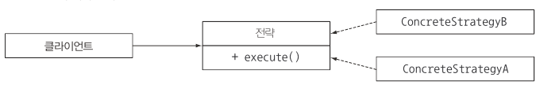

# 9. 리팩터링, 테스팅, 디버깅
# 가독성과 유연성을 개선하는 리팩터링

람다, 메서드참조, 스트림 등의 기능을 이용해서 더 가독성이 좋고 유연한 코드로 리팩터링 하는 방법

## 코드 가독성 개선

코드 가독성이 좋다는 것은 어떤 코드를 다른 사람도 쉽게 이해할 수 있음 을 의미한다.

- 자바 8의 새 기능을 이용해 코드를 간결하고 이해하기 쉽게 만들고, 메서드 참조와 스트림 API를 이용해 코드의 의도를 명확하게 보여줄 수 있다.
    - 익명 클래스를  람다 표현식으로 리팩터링하기
    - 람다 표현식을 메서드 참조로 리팩터링하기
    - 명령형 데이터 처리를 스트림으로 리팩터링하기

## 익명 클래스를 람다 표현식으로 리팩터링하기

- 하나의 추상 메서드를 구현하는 익명 클래스는 람다 표현식으로 리팩터링할 수 있다.
- 람다 표현식을 이용해서 간결하고, 가독성이 좋은 코드를 구현할 수 있다.

```java
// 익명 클래스
Runnable r = new Runnable() {
    @Override
    public void run() {
        System.out.println("Hello");
    }
};

// 람다 표현식으로 변환
Runnable r = () -> System.out.println("Hello");
```

- 모든 익명 클래스를 람다 표현식으로 변환할 수 있는 것은 아니다.
    1. 익명 클래스에서 사용한 this와 super는 람다 표현식에서 다른 의미를 갖는다.
        1. 익명 클래스에서 this는 익명 클래스 자신을 가리킨다.
        2. 람다에서 this는 람다를 감싸는 클래스를 가리킨다.
    2. 익명 클래스는 감싸고 있는 클래스의 변수를 가릴 수 있다.(섀도 변수)
    3. 람다 표현식으로는 변수를 가릴 수 없다.

    ```java
    int a = 10;
    Runnable r = () -> {
        // a = 20; // 컴파일 에러
        System.out.println("Hello");
    };
    ```

    1. 익명 클래스를 람다 표현식으로 바꾸면 콘텍스트 오버로딩에 따른 모호함이 초래될 수 있다.
        1. 익명 클래스는 인스턴스화할 때 명시적으로 형식이 정해지는 반면 람다의 형식은 콘텍스트에 따라 달라지기 때문이다.

        ```java
        interface Task {
              public void execute();
        }
        
        public void doSomething(Runnable r) {
            r.run();
        }
        
        public void doSomething(Task a) {
            a.execute();
        }
        
        //익명 클래스 콘텍스트 전달
        doSomething(new Task() {
            @Override
            public void execute() {
                System.out.println("Danger danger!!");
            }
        });
        
        //모호함 발생 Runnable or Task ???
        doSomething(() -> System.out.println("Danger danger!!");)
        
        //람다 표현식 콘텍스트 전달
        doSomething((Task) () -> System.out.println("Danger danger!!"));
        ```


## 람다 표현식을 메서드 참조로 리팩터링하기

람다 표현식은 쉽게 전달할 수 있는 짧은 코드다. 하지만 람다 표현식 대식 메서드 참조를 이용하면 가독석을 높일 수 있다. 메서드 참조의 메서드명으로 코드의 의도를 명확하게 알릴 수 있다.

```java
//람다 표현식
Map<CaloricLevel, List<Dish>> dishesByCaloricLevel = menu.stream()
  .collect(groupingBy(
      dish -> {
          if (dish.getCalories() <= 400) return CaloricLevel.DIET;
          else if (dish.getCalories() <= 700) return CaloricLevel.NORMAL;
          else return CaloricLevel.FAT;
      }
  ));
  
//메서드 참조
Map<CaloricLevel, List<Dish>> dishesByCaloricLevel2 = menu.stream()
    .collect(groupingBy(Dish::getCaloricLevel));
```

- 람다 표현식을 별도의 메서드로 추출한 다음에 groupingBy에 인수로 전달.

### comparing

```java
inventory.sort(
	(Apple a1, Apple a2) -> a1.getWeight().compareTo(a2.getWeight()));
	// 비교 구현에 신경 써야한다.
)

// 메서드 참조
inventroy.sort(comparing(Apple::getWeight)); //코드 자체가 문제를 설명
```

### sum, maximum등 자주 사용하는 리듀싱 연산

```java
//저수준 리듀스
int totalCalories = menu.stream().map(Dish::getCalories).reduce(0, (c1, c2) -> c1 + c2);

//메서드 참조
int totalCalories = menu.stream().collect(summingInt(Dish::getCalories));
```

## 명령형 데이터 처리를 스트림으로 리팩터링하기

- 스트림 API를 이용하면 문제를 더 직접적으로 기술할 수 있을 뿐 아니라 쉽게 병렬화할 수 있다.

```java
List<String> dishNames = new ArrayList<>();
for(Dish dish: menu) {
	if(dish.getCalories() > 300) {
		dishNames.add(dish.getName());
	}
}

menu.parallelStream()
	.filter(d -> d.getCalories > 300)
	.map(Dish::getName)
	.collect(toList());
```

## 코드 유연성 개선

- 람다 표현식을 이용하면 동작 파라미터화를 쉽게 구현할 수 있다. 즉, 다양한 람다를 전달해서 다양한 동작을 표현할 수 있다.
- 변화하는 요구사항에 대응할 수 있는 코드를 구현할 수 있다.

### 함수형 인터페이스 적용

람다 표현식을 이용하려면 함수형 인터페이스가 필요하다. 조건부 연기 실행과 실행 어라운드 두 가지 패턴으로 살펴보자

### 조건부 연기 실행

```java
if(logger.isLoggable(Level.FINER)) {
    logger.finer("Problem: " + generateDiagnostic());
}
```

- looger의 상태가 isLoggable이라는 메서드에 의해 클라이언트 코드로 노출된다.
- 메세지를 로깅할 때마다 logger 객체의 상태를 매번 확인한다.

```java
public void log(Level level, Supplier<String> msgSupplier) {
	if(logger.isLoggable(level) {
		log(level, msgSupler.get()); //람다 실행
	}
}

logger.log(Level.FINER, () -> "Problem: " + generateDiagnostic());

```

- 특정 조건에서만 메시지가 생성될 수 있도록 메시지 생성 과정을 연기할 수 있어야 한다.
- 이와 같은 logger 문제를 해결할 수 있도록 Supplier를 인수로 갖는 오버로드된 log 메서드를 제공했다.
- log 메서드는 logger의 수준이 적절하게 설정되어 있을 때만 인수로 넘겨진 람다를 내부적으로 실행하
- 해결한 문제
    - 만일 클라이언트 코드에서 객체 상태를 자주 확인하거나, 객체의 일부 메서드를 호출하는 상황 이라면 내부적으로 객체의 상태를 확인한 다음에 메서드를 호출 하도록 새로운 메서드를 구현하는 것이 좋다.
    - 코드 가독성이 좋아질 뿐 아니라 캡슐화도 강화된다.

### 실행 어라운드

매번 같은 준비, 종료 과정을 반복적으로 수행하는 코드가 있다면 이를 람다로 변환할 수 있다.

- 준비, 종료 과정을 처리하는 로직을 재사용함으로써 코드 중복을 줄일 수 있다.

```java
//기존 코드
public static String processFile() throws IOException {
    try (BufferedReader br = new BufferedReader(new FileReader("data.txt"))) {
        return br.readLine();
    }
}

//함수형 인터페이스를 이용해 리팩터링한 코드
public static String processFile(BufferedReaderProcessor p) throws IOException {
    try (BufferedReader br = new BufferedReader(new FileReader("data.txt"))) {
        return p.process(br);
    }
}

//함수형 인터페이스를 이용해 리팩터링한 코드를 호출하는 코드
String oneLine = processFile((BufferedReader br) -> br.readLine());
```

# 람다로 객체지향 디자인 패턴 리팩터링 하기

다양한 패턴을 유형별로 정리한 것이 디자인 패턴이다. 디자인 패턴은 공통적인 소프트웨어 문제를 설계할 때 재사용할 수 있는, 검증된 청사진을 제공한다. 디자인 패턴은 재사용할 수 있는 부품으로 여러 가지 다리 (현수교, 아치교등)를 건설하는 엔지니어링에 비유할 수 있다.

예를 들어 구조체와 동작하는 알고리즘을 서로 분리하고 싶을 때 반문자 디자인 패턴을 이용할 수 있다. 또 다른 예로 싱글턴 패턴을 이용해서 클래스 인스턴스화를 하나의 객체로 재현할 수 있다.

## 전략 패턴

전략 패턴은 한 유형의 알고리즘을 보유한 상태에서 런타임에 적절한 알고리즘을 선택하는 기법이다.



- 알고리즘을 나타내는 인터페이스
- 다양한 알고리즘을 나타내는 한 개 이상의 인터페이스 구현(구체적인 구현 클래스)
- 전략 객체를 사용하는 한 개 이상의 클라이언트

```java
// 다양한 텍스트 포맷 검증

//String 문자열을 검증하는 인터페이스 구현
public interface ValidationStratey {
	boolean execute(String s);
}

//인터페이스를 구현하는 클래스를 정의
public class IsAllLowerCase implements ValidationStrategy {
    @Override
    public boolean execute(String s) {
        return s.matches("[a-z]+");
    }
}

public class IsNumeric implements ValidationStrategy {
    @Override
    public boolean execute(String s) {
        return s.matches("\\d+");
    }
}

//구현한 클래스를 다양한 검증 전략으로 활용
public class Validator {
    private final ValidationStrategy strategy;
    public Validator(ValidationStrategy v) {
        this.strategy = v;
    }
    public boolean validate(String s) {
        return strategy.execute(s);
    }
}

//테스트
public class ValidatorExample {
    public static void main(String[] args) {
        Validator numericValidator = new Validator(new IsNumeric());
        boolean b1 = numericValidator.validate("aaaa");
        System.out.println(b1);

        Validator lowerCaseValidator = new Validator(new IsAllLowerCase());
        boolean b2 = lowerCaseValidator.validate("bbbb");
        System.out.println(b2);

        // 람다 표현식을 전달
        Validator numericValidator2 = new Validator((String s) -> s.matches("[a-z]+"));
        boolean b3 = numericValidator2.validate("aaaa");
        System.out.println(b3);

        Validator lowerCaseValidator2 = new Validator((String s) -> s.matches("\\d+"));
        boolean b4 = lowerCaseValidator2.validate("bbbb");
        System.out.println(b4);
    }
}
```

- ValidationStratey는 함수형 인터페이스이며 Predicate<String>과 같은 함수 디스크립터를 갖고 있으므로 다양한 전략을 구현하는 새로운 클래스를 구현할 필요가 없이 람다 표현식을 직접 전달하면 코드가 간결해진다.
- 람다 표현식을 사용하여 자잘한 코드를 제거하며, 코드 조각(또는 전략)을 캡슐화 한다.

## 템플릿 메서드

알고리즘의 개요를 제시한 다음에 알고리즘의 일부를 고칠 수 있는 유연함을 제공해야 할 때 템플릿 메서드 디자인 패턴을 사용한다. 쉽게 말해 이 알고리즘을 사용하고 싶은데 그대로는 안 되고 조금 고쳐야 하는 상황에 적합하다.

```java
//온라인 뱅킹 애플리케이션의 동작을 정의하는 추상 클래스
abstract class OnlineBanking {
    public void processCustomer(int id) {
        Customer c = Database.getCustomerWithId(id);
        makeCustomerHappy(c);
    }
    abstract void makeCustomerHappy(Customer c);
}
```

- processCustomer메서드는 온라인 뱅킹 알고리즘이 해야 할 일을 보여준다. 우선 주어진 고객 ID를 이용해서 고객을 만족시켜야 한다.  각각의 지점은 OnlineBanking 클래스를 상속받아 makeCustomerHappy 메서드가 원하는 동작을 수행하도록 구현할 수 있다.

### 람다 표현식 사용

알고리즘의 개요를 만든 다음에 구현자가 원하는 기능을 추가할 수 있게 만들면 된다.

```java
//템플릿 메서드 패턴
abstract class OnlineBanking {
    public void processCustomer(int id) {
        Customer c = Database.getCustomerWithId(id);
        makeCustomerHappy(c);
    }

    abstract void makeCustomerHappy(Customer c);
}

//람다를 이용한 템플릿 메서드 패턴
public class OnlineBankingLambda {
    public void processCustomer(int id, Consumer<Customer> makeCustomerHappy) {
        Customer c = Database.getCustomerWithId(id);
        makeCustomerHappy.accept(c);
    }
}

//테스트
public class OnlineBankingExample {
    public static void main(String[] args) {

        //템플릿 메서드를 사용한 예제
        new OnlineBanking() {
            @Override
            void makeCustomerHappy(Customer c) {
                System.out.println("Hello " + c.getName());
            }
        }.processCustomer(1337);

        //람다 표현식을 사용한 예제
        new OnlineBankingLambda().processCustomer(1337, (Customer c) -> System.out.println("Hello " + c.getName()));
    }
}
```

- 람다 표현식을 이용하면 템플릿 메서드 디자인 패턴에서 발생하는 자잘한 코드도 제거할 수 있다.

## 옵저버 패턴

어떤 이벤트가 발생했을 때 한 객체(주제 라 불리는)가 다른 객체 리스트(옵저버 라 불리는)에 자동으로 알림을 보내야 하는 상황에서 옵저버 디자인 패턴을 사용한다. GUI 애플리케이션에서 옵저버 패턴이 자주 등장한다.

버튼같은 GUI 컴포넌트에 옵저버를 설정할 수 있다. 그리고 사용자가 버튼을 클릭하면 옵저버에 알림이 전달되고 정해진 동작이 수행된다.


```java
//다양한 옵저버를 그룹화할 Observer 인터페이스 구현
public interface Observer {
    void notify(String tweet);
}

//다양한 키워드에 다른 동작을 수행할 수 있는 여러 옵저버를 정의
public class Guardian implements Observer{
    @Override
    public void notify(String tweet) {
        if (tweet != null && tweet.contains("queen")) {
            System.out.println("Yet another news in London... " + tweet);
        }
    }
}

public class LeMonde implements Observer{
    @Override
    public void notify(String tweet) {
        if (tweet != null && tweet.contains("wine")) {
            System.out.println("Today cheese, wine and news! " + tweet);
        }
    }
}

public class NYTimes implements Observer{
    @Override
    public void notify(String tweet) {
        if (tweet != null && tweet.contains("money")) {
            System.out.println("Breaking news in NY! " + tweet);
        }
    }
}

//주제 구현
public interface Subject {
    void registerObserver(Observer o);
    void notifyObservers(String tweet);
}

public class Feed implements Subject{
    private final List<Observer> observers = new ArrayList<>();
    @Override
    public void registerObserver(Observer o) {
        this.observers.add(o);
    }

    @Override
    public void notifyObservers(String tweet) {
        observers.forEach(o -> o.notify(tweet));
    }
}

//테스트
public class FeedExample {
    public static void main(String[] args) {
        Feed f = new Feed();
        f.registerObserver(new NYTimes());
        f.registerObserver(new Guardian());
        f.registerObserver(new LeMonde());
        f.notifyObservers("The queen said her favourite book is Java 8 in Action!");
    }
}
```

### 람다 표현식 사용하기

```java
//람다 표현식을 사용한 예제
f.registerObserver((String tweet) -> {
    if (tweet != null && tweet.contains("money")) {
        System.out.println("Breaking news in NY! " + tweet);
    }
});

f.registerObserver((String tweet) -> {
    if (tweet != null && tweet.contains("queen")) {
        System.out.println("Yet another news in London... " + tweet);
    }
});
```

- Observer 인터페이스를 구현하는 모든 클래스는 하나의 메서드 notify를 구현했다.
- 옵저버를 명시적으로 인스턴스화하지 않고 람다 표현식을 직접 전달해서 실행할 동작을 지정할 수 있다.
- 옵저버가 상태를 가지며, 여러 메서드를 정의하는 등 복잡하다면 람다 표현식보다 기존의 클래스구현방식을 고수하는 것이 바람직할 수 있다.

## 의무 체인 패턴

작업 처리 객체의 체인(동작 체인 등)을 만들 때는 의무 체인 패턴을 사용한다. 한 객체가 어떤 작업을 처리한 다음에 다른 객체로 결과를 전달하고, 다른 객체도 해야 할 작업을 처리한 다음에 또 다른 객체로 전달하는 식이다.

```java
//일반적으로 다음으로 처리할 객체 정보를 유지하는 필드를 포함하는 작업 처리 추상 클래스로 구현
public abstract class PorcessingObject<T> {
    protected PorcessingObject<T> successor;

    public void setSuccessor(PorcessingObject<T> successor) {
        this.successor = successor;
    }

    public T handle(T input) {
        T r = handleWork(input);
        if (successor != null) {
            return successor.handle(r);
        }
        return r;
    }

    abstract protected T handleWork(T input);
}
```

- 작업 처리 객체가 자신의 작업을 끝냈으면 다음 작업 처리 객체로 결과를 전달한다.


- 템플릿 메서드 디자인 패턴이 사용되었다.
- handle 메서드는 일부 작업을 어떻게 처리해야 할지 전체적으로 기술한다.
- ProcessingObject 클래스를 상속받아 handleWork 메서드를 구현하여 다양한 종류의 작업 처리 객체를 만들 수 있다.

```java
//작업 처리 객체 구현
public class HeaderTextProcessing extends ProcessingObject<String> {
    @Override
    protected String handleWork(String text) {
        return "From Raoul, Mario and Alan: " + text;
    }
}

public class SpellCheckerProcessing extends ProcessingObject<String> {
    @Override
    protected String handleWork(String text) {
        return text.replaceAll("labda", "lambda");
    }
}

//두 작업 처리 객체를 연결해서 작업 체인을 만들 수 있다.
ProcessingObject<String> p1 = new HeaderTextProcessing();
ProcessingObject<String> p2 = new SpellCheckerProcessing();
p1.setSuccessor(p2);
String result1 = p1.handle("Aren't labdas really sexy?!!");
System.out.println(result1);
//result1 = "From Raoul, Mario and Alan: Aren't lambdas really sexy?!!"
```

### 람다 표현식 사용

작업 처리 객체를 Function<String, String>, 정확히 표현하자면 UnaryOperator<String> 형식의 인스턴스로 표현할 수 있다.

```java
// 람다 표현식을 사용한 예제
UnaryOperator<String> headerProcessing = (String text) -> "From Raoul, Mario and Alan: " + text;
UnaryOperator<String> spellCheckerProcessing = (String text) -> text.replaceAll("labda", "lambda");
Function<String, String> pipeline = headerProcessing.andThen(spellCheckerProcessing);
String result2 = pipeline.apply("Aren't labdas really sexy?!!");
System.out.println(result2);
//result2 = "From Raoul, Mario and Alan: Aren't lambdas really sexy?!!"
```

## 팩토리 패턴

인스턴스화 로직을 클라이언트에 노출하지 않고 객체를 만들 때 팩토리 디자인 패턴을 사용한다. 예를 들어 우리가 은행에서 일하고 있는데 은행에서 취급하는 대출, 채권, 주식 등 다양한 상품을 만들어야 한다고 가정하자.

```java
public class ProductFactory {
    public static Product createProduct(String name) {
        switch (name) {
            case "loan":
                return new Loan();
            case "stock":
                return new Stock();
            case "bond":
                return new Bond();
            default:
                throw new RuntimeException("No such product " + name);
        }
    }
}

//팩토리 패턴을 사용하면 객체 생성을 캡슐화할 수 있다.
Product loan = ProductFactory.createProduct("loan");
Product stock = ProductFactory.createProduct("stock");
Product bond = ProductFactory.createProduct("bond");
```

- Loan, Stock, Bond는 모두 Product의 서브형식이다. createProduct 메서드는 생산된 상품을 설정하는 로직을 포함할 수 있다. 이는 부가적인 기능일 뿐 위 코드의 진짜 장점은 생성자와 설정을 외부로 노출하지 않음으로써 클라이언트가 단순하게 상품을 생산할 수 있다는 것이다.

### 람다 표현식 사용

```java
//람다 표현식을 사용
Supplier<Product> loanSupplier = Loan::new;
Product loan2 = loanSupplier.get();

//Map으로 코드 재구현
public static Map<String, Supplier<Product>> map = new HashMap<>();
static {
    map.put("loan", Loan::new);
    map.put("stock", Stock::new);
    map.put("bond", Bond::new);
}

public static Product createProductLambda(String name) {
    Supplier<Product> p = map.get(name);
    if(p != null) return p.get();
    throw new IllegalArgumentException("No such product " + name);
}
```

- 람다로 다시 구현 했으나 팩토리 메서드 createProduct가 상품 생성자로 여러 인수를 전달하는 상황에서는 이 기법을 적용하기 어렵다. 단순한 Supplier 함수형 인터페이스로는 이 문제를 해결할 수 없다.

# 람다 테스팅

람다 표현식을 적용해 코드를 구현했다. 하지만 개발의 최종 목표는 제대로 작동하는 코드를 구현하는 것이지 깔끔한 코드를 구현하는 것이 아니다.

프로그램이 의도대로 동작하는지 확인할 수 있는 단위 테스팅을 진행한다.

```java
public class Point {
	private final int x;
	private final int y;

	private Point(int x, int y) {
		this.x = x;
		this.y = y;
	}

	public int getX() {return x};
	public int getY() {return y};

	public Point moveRightBy(int x) {
		return new Point(this.x + x, y);	
	}

}

@Test
pulic void testMoveRightBy() throw Exception {
	Point p1 = new point(5, 5);
	Point p2 = p1.moveRightBy(10);
	assertEqual(15, p2.getX());
	assertEqual(5, p2.getY());
}
```

## 보이는 람다 표현식의 동작 테스팅

moveRightBy는 public이므로 위 코드는 문제없이 동작한다. 따라서 테스트 케이스 내부에서 Point 클래스 코드를 테스트할 수 있다. 하지만 람다는 익면(결국 익명 함수)이므로 테스트 코드 이름을 호출할 수 없다.

따라서 필요하다면 람다를 필드에 저장해서 재사용할 수 있으며 람다의 로직을 테스트할 수 있다.

- 메서드를 호출하는 것처럼 람다를 사용
- Point클래스에 compareByXAndThenY라는 정적 필드를 추가했다고 가정(compareByXAndThenY 를 이용하면 메서드 참조로 생성한 Comparator 객체에 접근할 수 있다.)

```java
pulic class Point {
	public final static Comparator<Point> compareByXAndThenY =
		comparing(Point::getX).thenComparing(Point::getY);
}
```

- 람다 표현식은 함수형 인터페이스의 인스턴스를 생성한다.
- 따라서 생성된 인스턴스의 동작으로 람다 표현식을 테스트할 수 있다.

```java
@Test
public void testComparingTwoPoints() throw Exception {
	Point p1 = new point(5, 5);
	Point p2 = p1.moveRightBy(10);
	int result = Point.compareByXAndThenY.compare(p1, p2);
	assertTrue(result < 0);
}
```

## 람다를 사용하는 메서드의 동작에 집중하라

람다의 목표는 정해진 동작을 다른 메서드에서 사용할 수 있도록 하나의 조각으로 캡슐화하는 것이다. 그러려면 세부 구현을 포함하는 람다 표현식을 공개하지 말아야 한다. 람다 표현식을 사용하는 메서드의 동작을 테스트함으로써 람다를 공개하지 않으면서도 람다 표현식을 검증할 수 있다.

```java
public static List<Point> moveAllPointsRightBt(List<Point> points, int x) {
	return points.stream()
		.map(p -> new Point(p.getX() + x, p.getY()))
		.collect(toList());
}
```

- 위 코드에 람다 표현식 p -> new Point(p.getX() + x, p.getY()); 를 테스트하는 부분은 없다.
- 그냥 moveAllPointsRightBy 메서드를 구현한 코드일 뿐이다. 이제 moveAllPointsRightBy 메서드의 동작을 확인할 수 있다.

```java
@Test
public void testMoveAllPointsRightBy() throw Exception {
	List<Point> points = Array.asList(new Point(5, 5), new Point(10, 5));
	List<Point> expectedPoints = Array.asList(new Point(15, 5), new Point(20, 5));
	
	List<Point> newPoints = Point.moveAllPointsRightBy(points, 10;
	assertEquals(expectePoinsts, newPoints);
}
```

## 복잡한 람다를 개별 메서드로 분리하기

람다 표현식을 메서드 참조로 변경해 일반 메서드를 테스트하듯이 람다 표현식을 테스트할 수 있다.

## 고차원 함수 테스팅

함수를 인수로 받거나 다른 함수를 반환하는 메서드(고차원함수)는 좀 더 사용하기 어렵다. 메서드가 람다를 인수로 받는다면 다른 람다로 메서드의 동작을 테스트 할 수 있다.

```java
@Test
public void testFilter() throw Exception {
	List<Integer> numbers = Arrays.asList(1, 2, 3, 4);
	List<Integer> even = filter(numbers, i -> i % 2 == 0);
	List<Integer> smallerThanThree = filter(numbers, i -> i < 3);
	assertEquals(Arrays.asList(2, 4), even);
	assertEquals(Arrays.asList(1, 2), smallerThanThree);

}
```

- 테스트해야 할 메서드가 다른 함수를 반환한다면 Comparator에서 살펴봤던 것처럼 함수형 인터페이스의 인스턴스로 간주하고 함수의 동작을 테스트할 수 있다.

# 디버깅

문제가 발생한 코드를 디버깅할 때 개발자는 두 가지를 가장 먼저 확인해야 한다.

- 스택 트레이스
- 로깅

하지만 람다 표현식과 스트림은 기존의 디버깅 기법을 무력화한다.

## 스택 트레이스 확인

예외 발생으로 프로그램이 실행 중지되면 스택 프레임에서 정보를 얻을 수 있다.

프로그램이 메서드를 호출할 때마다 프로그램에서의 호출 위치, 호출할 때의 인수값, 호출된 메서드의 지역 변수 등을 포함한 호출 정보가 생성되며 이들 정보는 스택 프레임에 저장된다.

### 람다와 스택 트레이스

람다 표현식은 이름이 없기 때문에 조금 복잡한 스택 트레이스가 생성된다.

```java
//고의적으로 문제를 일으킴
public class Debugging{
	public static void main(String[] args) {
		List<Point> points = Arrays.asList(new Point(12,2), null);
		points.stream().map(p -> p.getX()).forEach(System.out::println);
	}
}

//실행
Exception in thread "main" java.lang.NullPointerException: Cannot invoke "classes.Point.getX()" because "p" is null
	at ch09_리팩터링_테스팅_디버깅.Debugging.lambda$main$0(Debugging.java:11)
	at java.base/java.util.stream.ReferencePipeline$3$1.accept(ReferencePipeline.java:197)
	at java.base/java.util.Spliterators$ArraySpliterator.forEachRemaining(Spliterators.java:992)
	at java.base/java.util.stream.AbstractPipeline.copyInto(AbstractPipeline.java:509)
	at java.base/java.util.stream.AbstractPipeline.wrapAndCopyInto(AbstractPipeline.java:499)
	at java.base/java.util.stream.ForEachOps$ForEachOp.evaluateSequential(ForEachOps.java:150)
	at java.base/java.util.stream.ForEachOps$ForEachOp$OfRef.evaluateSequential(ForEachOps.java:173)
	at java.base/java.util.stream.AbstractPipeline.evaluate(AbstractPipeline.java:234)
	at java.base/java.util.stream.ReferencePipeline.forEach(ReferencePipeline.java:596)
	at ch09_리팩터링_테스팅_디버깅.Debugging.main(Debugging.java:11)
```

- lambda$main$0 람다 표현식은 이름이 없으므로 컴파일러가 람다를 참조하는 이름을 만들어낸 것이다.
- 메서드 참조를 사용해도 스택 트레이스에는 메서드명이 나타나지 않는다.
- 메서드 참조를 사용하는 클래스와 같은 곳에 선언되어 있는 메서드를 참조할 때는 메서드 참조이름이 스택 트레이스에 나타난다.
- 따라서 람다 표현식과 관련한 스택 트레이스는 이해하기 어려울 수 있다는 점을 염두해야 한다.

## 정보 로깅

스트림의 파이프라인 연산을 디버깅한다고 가정하자.

```java
List<Integer> numbers = Arrays.asList(2, 3, 4, 5);

numbers.stream()
	.map(x -> x + 17)
	.filter(x -> x % 2 == 0)
	.limit(3)
	.forEach(System.out::println);
```

- forEach를 호출하는 순간 전체 스트림이 소비된다. 스트림 파이프라인에 적용된 각각의 연산(map, filter, limit)이 어떤 결과를 도출하는지 확인할 수 있다면 좋을 것 같다.
- 바로 peek이라는 스트림 연산을 활용할 수 있다. peek은 스트림의 각 요소를 소비한 것처럼 도작을 실행한다. 하지만 forEach처럼 실제로 스트림의 요소를 소비하지는 않는다. peek은 자신이 확인한 요소의 파이브라인의 다은 연산으로 그대로 전달한다.
- peek의 연산 동작모습


```java
List<Integer> result = numbers.stream()
	.peek(x -> System.out.println("from stream: " + x))
	.map (x -> x + 17)
	.peek(x -> System.out.println("after map : " + x))
	.filter(x -> x % 2 == 0)
	.peek(x -> System.out.println("from filter: " + x))
	.limit(3)
	.peek(x -> System.out.println("from limit: " + x))
	.collect(toList());
```

# 마무리

- 람다 표현식으로 가독성이 좋고 더 유연한 코드를 만들 수 있다.
- 익명 클래스는 람다 표현식으로 바꾸는 것이 좋다. 하지만 이때 this, 변수 섀도 등 미묘하게 의미상 다른 내용이 있음을 주의하자.
- 메서드 참조로 람다 표현식보다 더 가독성이 좋은 코드를 구현할 수 있다.
- 반복적으로 컬렉션을 처리하는 루틴은 스트림 API로 대체할 수 있을지 고려하는 것이 좋다.
- 람다 표현식으로 전략, 템플릿 메서드, 옵저버, 의무 체인, 팩토리 등의 객체지향 디자인 패턴에서 발생하는 불필요한 코드를 제거할 수 있다.
- 람다 표현식도 단위 테스트를 수행할 수 있다. 하지만 람다 표현식 자체를 테스트하는 것보다는 람다 표현식이 사용되는 메서드의 동작을 테스트하는 것이 바람직하다.
- 복잡한 람다 표현식은 일반 메서드로 재구현할 수 있다.
- 람다 표현식을 사용하면 스택 트레이스를 이해기 어려워진다.
- 스트림 파이프라인에서 요소를 처리할 때 peek 메서드로 중간값을 확인할 수 있다.