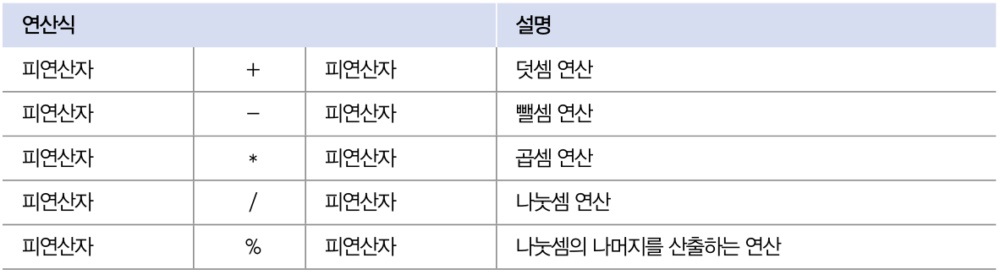
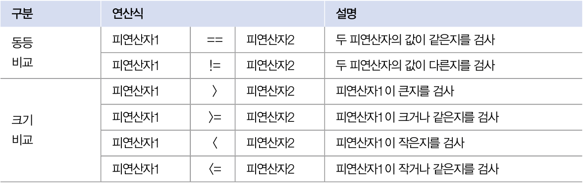
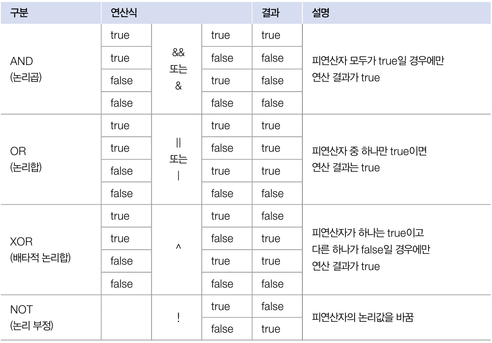

# 3. 연산자

## 부호/증감 연산자

- 부호 연산자는 변수의 부호를 유지하거나 변경한다.

| 연산식 | 설명 |
| --- | --- |
| + 피연산자 | 피연산자 부호 유지 |
| - 피연산자 | 피연산자 부호 변경 |
- 정수 타입(byte, short, int)의 연산 결과는 int 타입이다.

```java
byte b = 100;
byte result = -b // 컴파일 에러
int result = -b // int 타입 변수에 대입
```

- 증감 연산자는 변수의 값을 1 증가 시키거나 1 감소시킨다.

| 연산식 | 설명 |
| --- | --- |
| ++ 피연산자 | 피연산자의 값을 1증가 |
| -- 피연산자 | 피연산자의 값을 1 감소 |
| 피연산자 ++ | 다른 연산 수행후 피연산자의 값 1 증가 |
| 피연산자 -- | 다른 연산을 수행 후 피연사자의 값을 1 감소 |
- 변수 단독으로 증감 연사자 사용시 변수의 위치와 상관없이 결과 동일

```java
int x = 1;
int y = 1;
int result1 = ++x + 10; => result = 12
int result2 = y++ + 10; => result = 11, y = 2  
```

## 산술 연산자



- 피연산자가 정수 타입이면 연산 결과는 int 타입이다.
- 피연산자가 정수 타입이고 그 중 하나가 long 타입이면 연산의 결과는 long이다
- 피연산자중 하나가 실수 타입이면 연산의 결과는 실수 타입이다.

## 오버플로우와 언더 플로우

- 오버플로우: 타입이 허용하는 최대값을 벗어나는 것
- 언더플로우: 타입이 허용하는 최소값을 벗어 나는 것

```java
//오버플로우
byte value = 127;
value ++;
// value = - 128

//언더플로우
byte value = -128;
vlaue --;
// value = 127
```

- 오버플로우,언더플로우 발생하지 않게 정확한 범위 내의 타입으로 계산

## 정확한 계산은 정수 연산으로

- 산술 연산을 정확하게 계산하고 싶다면 실수 타입을 사용하지 않는 것이 좋다.
- 부동 소수점 방식을 사용하는 실수 타입에서 정확한 계산이 힘들다.

## 나눗셈 연산 후 NaN과 Infinity 처리

- 나눗셈 또는 나머지 연산에서 좌측 피연산자가 정수이고 우측 피연산자가 0일 경우 예외 발생

```java
int x = 5;
int y = 0;
int result = 5 / 0; // 예외발생 
```

- 좌측 피연산자가 실수이거나 우측 피연산자가 0.0 또는 0.0f이면 예외가 발생하지 않고 연산 결과는 Infinity 또는 NaN이 된다

```java
Infinity + x = Infinity 
NaN + x = NaN 
```

- Infinity 또는 NaN인지 먼저 확인하고 연산 수행

```java
boolean result = Double.isInfinite(변수);
boolean result = Double.isNan(변수);
```

## 비교 연산자

- 비교 연산자는 동등 또는 크기 를 평가해서 boolean 타입인 true/fasle를 반환한다.
- 흐름제어문인 조건문, 반복문에서 실행 흐름을 제어할 때 주로 사용된다.



- 피연산자의 타입이 다를 경우에 비교 연산을 수행하기 전에 타입을 일치 시킨다.
- 예외로 부동 소수점 방식을 사용하는 실수 타입은 0.1을 정확하게 표현할 수 없을뿐 아니라 float타입과 double 타입의 정밀도 차이도 있기 때문이다. 피연산자를 float 타입으로 강제 타입 변환 후에 비교 연산을 하면 해결된다.

```java
0.1f == 0.1 //false
0.1f == (float)0.1// true
```

## 논리 연산자

- 논리 연산자는 논리곱, 논리합,배타적 논리합, 논리 부정 연산을 수행한다.
- 흐름제어문인 조건문, 반복문에서 실행 흐름을 제어할 때 주로 사용된다.


